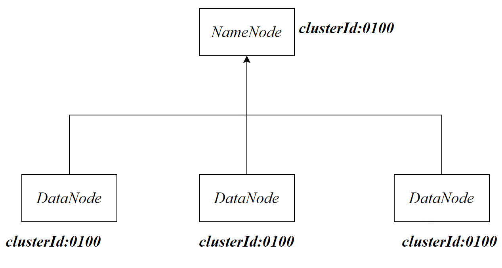
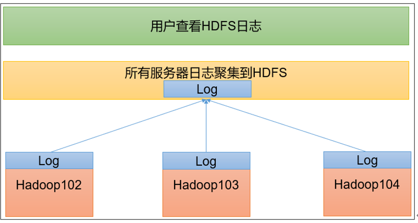

# Hadoop安装

## 配置JDK

在Hadoop的运行环境`hadoop-env.sh`中需要配置JDK所在的位置

```bash
export JAVA_HOME=/usr/local/java/jdk1.8.0_351
```

当在命令行输入hadoop出现信息，表示hadoop安装成功

```bash
hadoop
```

## 配置HADOOP_HOME

1. **设置全局的环境变量**：`/etc/.profile` 中可以定义全局的环境变量，这些变量对所有用户都可见。例如，您可以在这里设置`PATH`变量，以确保系统中的所有用户都能够访问相同的命令。
2. **定义全局的命令别名**：您可以在此文件中为系统中的所有用户定义命令别名，以简化常用命令的使用。
3. 添加HADOOP_HOME和JAVA_HOME

```sh
export HADOOP_HOME=/usr/local/hadoop-3.2.3
export PATH=$PATH:$HADOOP_HOME/bin
export PATH=$PATH:$HADOOP_HOME/sbin
```


# Hadoop其他

## hadoop 目录结构

- bin：存放对Hadoop相关服务（hdfs，yarn，mapred）进行操作的脚本
- etc：Hadoop的配置文件目录，存放Hadoop的配置文件
- lib：存放Hadoop的本地库（对数据进行压缩解压缩功能）
- sbin：存放启动或停止Hadoop相关服务的脚本
- share：存放Hadoop的依赖jar包、文档、和官方案例

## Hadoop 运行模式

- 本地模式：单机运行，数据存储在本地，用于测试share中的案例
- 伪分布式：单机运行，但是具备Hadoop集群的所有功能，一台服务器模拟一个分布式的环境
- 完全分布式：多台服务器组成分布式环境。生产环境使用

# 配置文件

在Hadoop的所有集群上的所有主机同步以下配置文件

## hadoop-env.sh

hadoop运行环境

主要配置`JAVA_HOME`

```sh
export JAVA_HOME=/usr/lib/jvm/java-11-openjdk-amd64/
```

如果存在用户权限问题，还需要添加：

```sh
export HDFS_NAMENODE_USER=root
export HDFS_DATANODE_USER=root
export HDFS_SECONDARYNAMENODE_USER=root
export YARN_RESOURCEMANAGER_USER=root
export YARN_NODEMANAGER_USER=root
```


## core-site.xml

-  描述集群中NameNode结点的URI(包括协议、主机名称、端口号)，hdfs为协议名

  ```xml
  <property>
            <name>fs.defaultFS</name>
            <value>hdfs://master:8020</value>
            <final>true</final>
  </property>
  ```

  `final`表示最终值，不允许改变

-  hadoop的临时存储路径

   ```xml
       <property>
           <name>hadoop.tmp.dir</name>
           <value>file:/usr/local/hadoop/tmp</value>
       </property>
   ```

   web界面操作的用户
   
   ```xml
       <!-- 配置HDFS网页登录使用的静态用户为root -->
       <property>
           <name>hadoop.http.staticuser.user</name>
           <value>root</value>
       </property>
   ```
   
   

## hdfs-site.xml

- NameNode的数据目录

```xml
    <property>
        <name>dfs.namenode.name.dir</name>
        <value>file:/usr/local/hadoop/hdfs/namenode</value>
    </property>
```

```xml
    <property>
        <name>dfs.datanode.data.dir</name>
        <value>file:/usr/local/hadoop/hdfs/datanode</value>
    </property>
```
- 数据副本的数量
```xml
    <property>
        <name>dfs.replication</name>
        <value>2</value>
    </property>
```

- block数据块大小，默认值为128M

```xml
    <property>
        <name>dfs.blocksize</name>
        <value>128m</value>
    </property>
```

- nameNode的web UI入口

```xml
    <property>
        <name>dfs.namenode.http-address</name>
        <value>master:50070</value>
    </property>
```


## workers

描述了所有的工作节点的主机名/IP地址。不能存在空格/回车

```
master
slave01
slave02
```

## mapred-site.xml

```xml
    <property>
        <name>mapreduce.framework.name</name>
        <value>yarn</value>
    </property>
```

如果mapreduce无法正常使用，还需要配置：

```xml
<property>
  <name>yarn.app.mapreduce.am.env</name>
  <value>HADOOP_MAPRED_HOME=/usr/local/hadoop-3.2.4</value>
</property>
<property>
  <name>mapreduce.map.env</name>
  <value>HADOOP_MAPRED_HOME=/usr/local/hadoop-3.2.4</value>
</property>
<property>
  <name>mapreduce.reduce.env</name>
  <value>HADOOP_MAPRED_HOME=/usr/local/hadoop-3.2.4</value>
</property>
```

可选配置：resourceManager的历史服务器

```xml
<!-- 历史服务器端地址 -->
<property>
    <name>mapreduce.jobhistory.address</name>
    <value>master:10020</value>
</property>

<!-- 历史服务器web端地址 -->
<property>
    <name>mapreduce.jobhistory.webapp.address</name>
    <value>master:19888</value>
</property>

```

历史服务器能够查看所有的历史记录

## yarn-site.xml

```xml
    <property>
        <name>yarn.nodemanager.aux-services</name>
        <value>mapreduce_shuffle</value>
    </property>
    
    <!-- 指定ResourceManager的地址-->
    <property>
        <name>yarn.resourcemanager.hostname</name>
        <value>master</value>
    </property>
```

开启日志聚集配置项：

```xml
<!-- 开启日志聚集功能 -->
<property>
    <name>yarn.log-aggregation-enable</name>
    <value>true</value>
</property>
<!-- 设置日志聚集服务器地址 -->
<property>  
    <name>yarn.log.server.url</name>  
    <value>http://hadoop102:19888/jobhistory/logs</value>
</property>
<!-- 设置日志保留时间为7天 -->
<property>
    <name>yarn.log-aggregation.retain-seconds</name>
    <value>604800</value>
</property>

```


## docker-compose.yml

```yaml
version: "3"
services:
  master:
    container_name: master
    image: zurichscud/ubuntu-hadoop:1.11
    hostname: master
    ports:
      - 9870:9870 #namenode web 
      - 8020:8020 #namenode的服务端口
      - 10020:10020 #历史服务器
      - 19888:19888 # 历史服务器web
      - 9866:9866 #datanode的服务端口
     
    command: sh -c "/etc/init.d/ssh start;tail -f /dev/null"
  slave01:
    image: zurichscud/ubuntu-hadoop:1.11
    container_name: slave01
    hostname: slave01
    ports:
      - 8088:8088 # resourcemanager web
      - 9864:9864 # web 依赖
    command: sh -c "/etc/init.d/ssh start;tail -f /dev/null"
  slave02:
    image: zurichscud/ubuntu-hadoop:1.11
    container_name: slave02
    hostname: slave02
    ports:
      - 9868:9868 #secondarynamenode web
    command: sh -c "/etc/init.d/ssh start;tail -f /dev/null"
```

`tail -f /dev/null`保持容器持续运行

`/etc/init.d/ssh start`启动SSH服务


# Hadoop启动

理论上，我们配置的hadoop集群应该如下：

|      | master                            | slave01                          | slave02                         |
| ---- | --------------------------------- | -------------------------------- | ------------------------------- |
| HDFS | NameNode<br />DataNode            | DataNode                         | SecondaryNameNode<br />DataNode |
| YARN | NodeManager<br />JobHistoryServer | ResourceManager<br />NodeManager | NodeManager                     |


## HDFS format

首次启动HDFS时，必须对其进行格式化操作，foramt本质上进行准备工作，生成ClusterId

在`nameode`所在的节点进行格式化：

```sh
hdfs namenode -format
```

format HDFS时，namenode和datanode将生成相同的集群id



如果再次format ，namenode将生成新的id，但是datanode依旧保留原来的id。此时namenode和datanode相当于在不同的集群中。为此我们需要删除datanode中的配置信息。再进行foramt操作即可生成相同的id

## hdfs启动

在`namenode`所在的节点启动hdfs

```sh
start-dfs.sh
```

## yarn启动

在配置了**`ResourceManager`**的节点启动YARN。

```sh
# slave01
start-yarn.sh
```

## 快速启动

如果namenode和resourceManager在同一个主机上，也可以在格式化后，使用如下命令，启动dfs和yarn

```sh
start-all.sh
```

## 操作单个节点的进程

单节点HDFS的启动与停止

```sh
hdfs --daemon start/stop 进程
```

进程：

- namenode
- datanode
- secondarynamenode

```sh
yarn --daemon start/stop  进程
```

进程：

- resourcemanager
- nodemanager

## web界面

查看namenode的web界面，9870是我们在hdfs-site.xml中设置的端口号

```sh
centos:9870
```

查看resourceManager的web界面，8088是默认的端口号

```sh
centos:8088
```

由于web界面使用的hostname都是各自的docker容器的hostname。我们可以访问docker所在的hostname来访问web界面

但是web界面中的请求hostname仍然不会改变，例如下载文件的请求为

http://slave02:9864/webhdfs/v1/wcinput/part-r-00000?op=OPEN&namenoderpcaddress=master:8020&offset=0

我们为了让slave02解析成centos所在IP地址。我们需要设置Windows本地的DNS服务器：

```sh
#C:\Windows\System32\drivers\etc
192.168.88.130 centos
192.168.88.130 master
192.168.88.130 slave01
192.168.88.130 slave02
```

此时web的所有请求都将会解析成`192.168.88.130`（Docker所在的主机）

## namenode运行失败

- 删除hadoop的tmp目录
- 删除hadoop的logs目录
- 重新进行namenode格式化

##  测试

```sh
hadoop jar share/hadoop/mapreduce/hadoop-mapreduce-examples-3.2.4.jar wordcount /input/README.txt /wcinput
```

## 启动历史服务器

在部署历史服务器的host上启动历史服务器：

```sh
mapred --daemon start historyserver
```

运行jps命令可以查看`JobHistoryServer`，说明历史服务器已正常启动

历史服务器web入口：19888

## 日志聚集

日志聚集可以让我们更加方便的查看每一台服务器的日志，各节点的日志最终都将汇集到HDFS



## 时间同步

服务器间的时间并不一定是相同的，服务器间时间同步可以保证一些定时任务能够正常执行

生产环境中如果能够连接外网，则不需要进行时间同步。

# IDEA环境设置

## winutils

下载对应版本的hadoop winutils，并设置环境变量HADOOP_HOME，并在PATH中写入

```sh
$HADOOP_HOME$/bin
```

点击`winutils.exe`启动 windows客户端

## 依赖注入

```xml
    <dependencies>
        <dependency>
            <groupId>org.apache.hadoop</groupId>
            <artifactId>hadoop-client</artifactId>
            <version>3.2.4</version>
        </dependency>
        <dependency>
            <groupId>junit</groupId>
            <artifactId>junit</artifactId>
            <version>4.13.1</version>
            <scope>test</scope>
        </dependency>
        <dependency>
            <groupId>org.slf4j</groupId>
            <artifactId>slf4j-log4j12</artifactId>
            <version>1.7.36</version>
        </dependency>
    </dependencies>
```

## java.lang.UnsatisfiedLinkError

创建org.apache.hadoop.io.nativeio包，并创建`NativeIO`类

代码见resources

