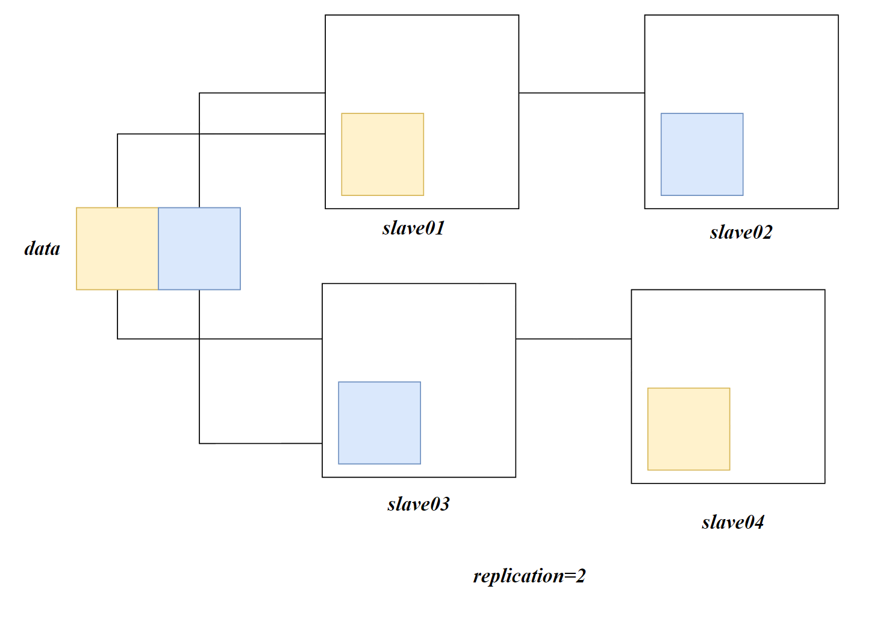
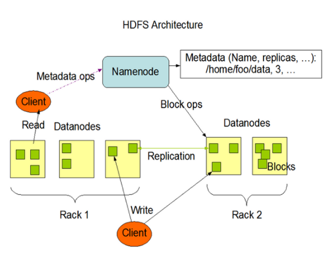
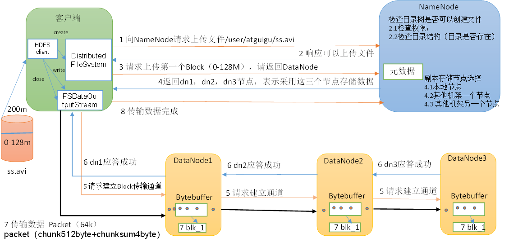
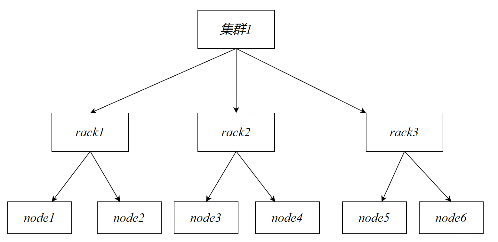
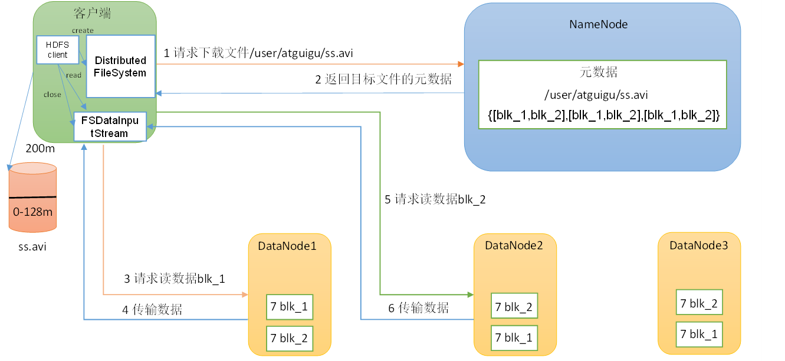
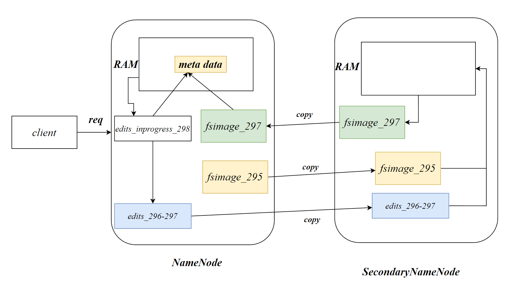
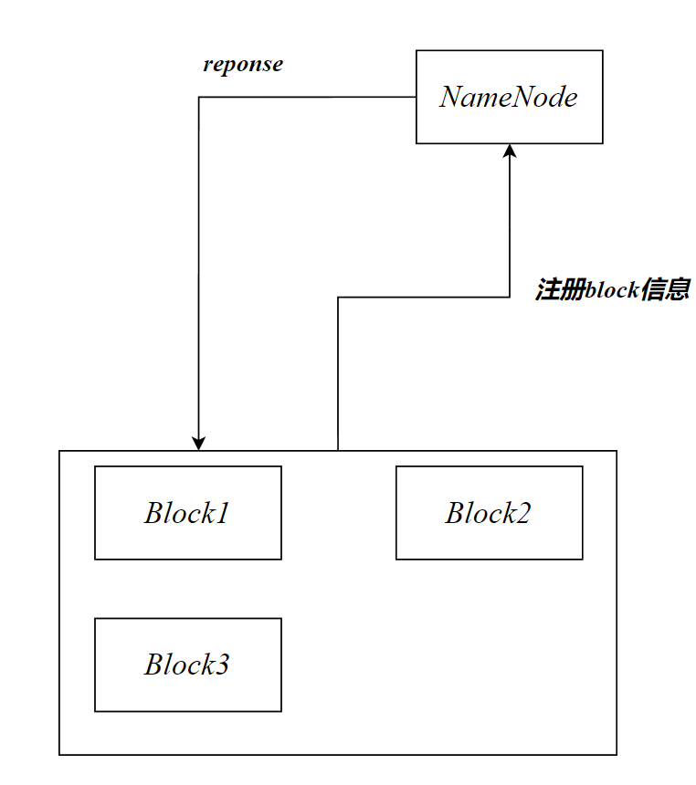

# HDFS概述

## 概述

*Hadoop Distributed File System*，Hadoop分布式文件系统。HDFS用于解决数据的海量存储问题

HFDS适合一次写入，多次读出的场景。一个文件经过HDFS存储后，就无法对其在进行修改，但是可以在末尾进行追加数据。


## HDFS优点

- 高容错性

数据自动保存多个副本，通过增加副本的形式，提高容错率

当某一个副本丢失以后，它会从其他副本复制进行**自动修复**



- 适合处理大数据

数据规模：能够处理PB级别的数据

文件规模：能够处理百万规模以上的文件数量

- 由于hafs的副本机制，其可以部署在廉价服务器上，因此对服务器的稳定性要求不高

## HDFS缺点

- 不适合低延时的数据访问，无法做到毫秒级别的读取数据
- 无法高效地对大量**小文件**进行存储。小文件的存储会占用namenode大量的存储来存储元数据，namenode的**内存**总是有限的
- 不支持并发的读写，一个文件只能有一个写，不允许多个线程同时写
- 仅支持数据的*append*操作，不支持文件的**随机修改**

## HDFS 1.0缺陷

- 命名空间的限制：名称节点的数据是保存在内存中的，因此名称节点能够容纳对象的个数会受到内存空间大小的限制
- 性能瓶颈：整个分布式文件系统的吞吐量受限于单个NameNode的吞吐量
- 隔离问题：由于集群中只有一个名称节点，只有一个命名空间，无法对不同的应用程序进行隔离
- 集群的可用性：一旦NameNode发生故障，会导致整个集群变得不可用

## HDFS组成



### NameNode

Master，HDFS的管理者。负责：

- 管理HDFS的名称空间（NameSpace）
- 配置副本策略
- 管理block的映射信息（DataNode提供）
- 处理客户端（web、CLI）的读写请求


### DataNode

NameNode下达命令，DataNode执行实际的操作

- 负责存储实际的数据块
- 执行数据块的读/写操作
- 向NameNode报告本机上存储的块信息id

### Client

客户端

- 文件上传至HDFS的时候，Client将文件切分成一个个的block，然后进行上传
- 客户端可以从namenode处获得文件的位置信息
- 客户端与datanode交互，执行读写操作
- 客户端供用户输入命令对HDFS进行管理，客户端可以支持打开、读取、写入等常见的操作 

- 客户端是用户操作HDFS最常用的方式，HDFS在部署时都提供了客户端
- HDFS客户端是一个库，暴露了HDFS文件系统接口
- 严格来说，客户端并不算是HDFS的一部分 

### SecondaryNameNode

NameNode的**冷备份**，当NameNode挂掉后，并不能替换NameNode提供服务。此时整个集群将无法继续工作。

他只能辅助NameNode，分担其工作量。在紧急情况下，辅助NameNode恢复有限的数据

## Block

数据在HDFS中以块的形式存储，一个数据可以被分成多个块，如果没有达到一个块大小，其就占用一个块。

在*Hadoop 1.0*中 Block的默认大小为64MB，*Hadoop2/3*提升到了128MB

>  为什么块大小默认设置成128MB？
>
> 寻址的最佳时间为10ms，寻址时间为I/O时间的1%时为最佳状态，因此数据传输的时间应该为1s
>
> 而目前磁盘的传输速率普遍在100MB/s
>
> 则一个block大小应该为100MB，最终选择128MB


HDFS的块设置过小会造成寻址时间的增加。HDFS的块设置过大，会导致分布式计算停滞在某一个块

HDFS的块大小主要取决于磁盘的传输速度

## replication

文件在hdfs中的副本数量，通常情况下，一个服务器只会保存一个block的一个副本，因为重复存储没有意义。

服务器挂掉，则这个服务器上的所有副本都会丢失，所以一个节点不会存储相同的块。

如果只有3个服务器存在datanode，块副本数量最多存储3份，如果设置超过服务器datanode的实际情况，也只会存在3个副本，当服务器扩容时，hdfs则会自动复制副本以尽量接近目标副本数量


## 元数据

NameNode存储着元数据，元数据在HDFS启动时会从磁盘中加载元数据的备份至内存中，元数据包括：

- 块映射信息，包括：file→block、block→datanode。
- 文件目录树，名称、权限、时间戳
- EditLog和FsImage是元数据的备份，存储在磁盘中

# Shell

## 上传

- 从本地移动文件至hdfs

```sh
hdfs -moveFromLocal  loaclpath hdfspath
```

- 从本地复制文件至hdfs

```sh
hdfs -copyFromLocal  loaclpath hdfspath
```

- put，与copyFromLocal等价

```sh
hdfs -put loaclpath hdfspath
```

- 追加一个文件至已存在的文件末尾

```sh
hdfs -appendToFile localpath hdfspath
```

## 下载

- 从HDFS拷贝至本地

```sh
hdfs -copyToLocal hdfspath localpath
```

- 等价于copyToLocal

```sh
hdfs -get  hdfspath loaclpath
```


## HDFS直接操作

- 显示目录信息

```sh
hdfs -ls  hdfspath
```

- 显示文件内容

```sh
hdfs -cat hdfspath
```

- 创建路径

```sh
hdfs -mkdir path
```

- 拷贝内容

```sh
hdfs -cp src dest
```

- 移动内容

```sh
hdfs -mv src dest
```

- 显示末尾1KB的数据

```sh
hdfs -tail path
```

- 删除文件/文件夹

```sh
hdfs -rm path
```

- 递归删除目录以及目录中的内容

```sh
hdfs -rm -r path
```

- 统计文件夹的大小信息

```sh
hdfs -du -s -h path
```

```sh
hdfs -du -s -h /input
```

> 1.3 K  4.0 K  /input


第一个结果表示该文件/文件夹的大小

第二个结果表示该目录存在多个副本，占用的磁盘大小为$1.3K*3=4K$

# API

## 创建客户端对象

```java
URI uri = new URI("hdfs://master:8020");
Configuration config = new Configuration();
config.set("dfs.client.use.datanode.hostname", "true");//以hostname进行通信，适用于docker环境
FileSystem fs = FileSystem.get(uri, config,"root");
//执行操作
fs.mkdirs(new Path("/input/idea"));
fs.close();
```

> *Docker*注意项
>
> 在docker compose中我们设置了datanode的端口为9866。当我们在windows环境下访问 datanode:9866会被静态DNS解析成centos:9866，根据docker容器的端口映射，其会访问docker中的master:9866。根据Hadoop的datanode同步机制，其会向其他datanode复制到指定副本数量
>
> 弊端：
>
> master永远都会存储一份block，截止2023/11/26尚未想到处理方案

## config

在Java的resources中也可以编写hadoop的配置文件。

配置文件的优先级：$ default</etc/hadoop<resources<java代码中的配置$

以配置replication为例：

- `default`

默认的replication=3，默认配置不需要配置

- `/etc/hadoop/hdfs-site.xml`

```xml
<?xml version="1.0" encoding="UTF-8"?>
<?xml-stylesheet type="text/xsl" href="configuration.xsl"?>
<configuration>
    <property>
        <name>dfs.replication</name>
        <value>1</value>
    </property>
</configuration>
```

- `resources`

```xml
<?xml version="1.0" encoding="UTF-8"?>
<?xml-stylesheet type="text/xsl" href="configuration.xsl"?>
<configuration>
    <property>
        <name>dfs.replication</name>
        <value>1</value>
    </property>
</configuration>
```

- `java`

```java
Configuration config = new Configuration();
config.set("dfs.replication","10");
```

如果上述配置都存在，最终的replication=10

## 常见命令

### 上传

从Windows本地复制文件至指定的hdfs path

```java
fs.copyFromLocalFile(delsrc,overwrite,srcpath,destpath)
```

- `delsrc`：*Boolean*，是否删除源文件
- `overwrite`：*Boolean* ，如果destpath中存在相同名的文件，是否允许覆盖
- `srcpath`：*Path*，客户端本地的源路径
- `destpath`：*Path*，hdfs的目标路径

```java
fs.copyFromLocalFile(false,false,new Path("C:\\Users\\zuric\\Desktop\\Project\\hello.txt"),
                     new Path("/input/idea"));

```

### 下载

```java
fs.copyToLocalFile(delSrc,srcpath,destpath,useRawLocalFileSystem)
```

- `delSrc` ：*Boolean*，是否删除源文件
- `srcpath`：*Path*，源路径
- `destpath`：*Path*，目标文件夹路径
- `useRawLocalFileSystem`：*Boolean*，是否本地校验，*true*将不会生成CRC文件

在destpath中将得到两个文件：

- 源文件
- 源文件.crc：*CRC*校验文件，用于校验数据传输后是否正确

```java
fs.copyToLocalFile(false,new Path("/input/idea/hello.txt"),new Path("./get"),true);
```


### 删除

```java
fs.delete(path,b);
```

- `path`：*Path*，待删除的文件路径
- `b`：*Boolean*，是否递归删除，当目录非空需要递归删除

```java
fs.delete(new Path("/input/idea/hello.txt"),false);
```

### rename

移动文件或重命名：

```java
fs.rename(path1,path2)
```

`path1`：*Path*，源路径

`path2`：*Path*，目标路径

```java
 fs.rename(new Path("/input/idea/hello2.txt"),new Path("/input/idea/hello.txt"));
```


## 获取hdfs详细信息

```java
fs.listFiles(path, recursive);
```

- `path`：*Path*，查看的路径
- `recursive`：*Boolean*，是否迭代
- *Return*：*RemoteIterator<LocatedFileStatus>*，迭代器对象

```java
  //获取迭代器
        RemoteIterator<LocatedFileStatus> listFiles = fs.listFiles(new Path("/"), true);
        //遍历
        while (listFiles.hasNext()){
            LocatedFileStatus fileStatus=listFiles.next();
            System.out.println(fileStatus.getPath());
            System.out.println(fileStatus.getPermission());
            System.out.println(fileStatus.getOwner());
            System.out.println(fileStatus.getLen());
            System.out.println(fileStatus.getModificationTime());
            System.out.println(fileStatus.getReplication());
            System.out.println(fileStatus.getBlockSize());
            System.out.println(fileStatus.getPath().getName());
            System.out.println(Arrays.toString(fileStatus.getBlockLocations()));
        }
```

- `getPath`获取路径

```java
hdfs://centos:8020/input/idea/hello.txt
```

- `getPermission` 获取权限

```java
rw-r--r--
```

- `getOwner`获取拥有者

- `getModificationTime`获取修改时间，得到的是时间戳

- `getReplication`获取副本数量

- `getBlockSize`获取块大小

- `getBlockLocations`获取块信息，Return得到的是Array

  ```java
  [offset,length,datanode1,datanode2,...]
  ```

  - `offset` 块的起始偏移
  - `length` 块大小，单位为B
  - `datanode`块所在的host

  ```java
  [0,134217728,slave01,slave02, 134217728,134217728,slave02,master, 268435456,134217728,slave02,slave01, 402653184,89715035,slave02,master]
  ```

### 文件/目录判断

获得path下的文件状态列表

```java
fs.listStatus(path)
```

- `path`：*Path*，路径
- `Return`：*FileStatus[]*，文件状态数组

*FileStatus*：

`isFile()`：是否是文件

```java
        FileStatus[] fileStatuses = fs.listStatus(new Path("/input/idea"));
        for (FileStatus status : fileStatuses) {
            System.out.println(status.getPath());
            System.out.println("是否目录"+status.isDirectory());
            System.out.println("是否文件"+status.isFile());
        }
```


# HDFS读写

## HDFS写入过程



1. 客户端通过Distributed FileSystem模块向NameNode请求上传文件，NameNode检查目标文件是否已存在、父目录是否存在。
2. NameNode返回是否可以上传的response。
3. 客户端请求第一个 Block上传到哪几个DataNode服务器上。
4. NameNode根据节点存储策略返回3个DataNode节点地址，分别为dn1、dn2、dn3。
5. 客户端通过FSDataOutputStream模块请求dn1上传数据，dn1收到请求会继续调用dn2，然后dn2调用dn3，将这个通信管道建立完成。
6. dn1、dn2、dn3逐级应答客户端。
7. 客户端开始往dn1上传第一个Block（先从磁盘读取数据放到本地内存缓存），以Packet为单位，dn1收到一个Packet就会传给dn2，dn2传给dn3；dn1每传一个packet会放入一个应答队列等待应答。【datanode负责block的复制】
8. 当一个Block传输完成之后，客户端再次请求NameNode上传第二个Block的服务器。（重复执行3-7步）。

## rack

机架，一个机架上可以放置多台服务器，一个集群通常由多个机架组成



node1可以表示为 $d1/rack1/node1$

根据树状结构可以发现节点之间进行通信需要找到他们共同的根节点才能够进行通信。

## 节点存储策略

默认设置的replication=3，namenode选择datanode的策略为：

第一个副本会存储在客户端当前的datanode上，如果是远程操作，则会随机选择一个datanode存储。

第二个副本会选择在不同机架上的上的一个datanode

最后一个副本会选择在相同机架上的不同datanode上

> For the common case, when the replication factor is three, HDFS’s placement policy is to put one replica on the local machine if the writer is on a datanode, otherwise on a random datanode, another replica on a node in a different (remote) rack, and the last on a different node in the same remote rack. This policy cuts the inter-rack write traffic which generally improves write performance. The chance of rack failure is far less than that of node failure; this policy does not impact data reliability and availability guarantees. However, it does reduce the aggregate network bandwidth used when reading data since a block is placed in only two unique racks rather than three. With this policy, the replicas of a file do not evenly distribute across the racks. One third of replicas are on one node, two thirds of replicas are on one rack, and the other third are evenly distributed across the remaining racks. This policy improves write performance without compromising data reliability or read performance.


这种策略可以最大程度的减少带宽的压力，又能够保证数据的可靠性，因为机架的故障率远小于主机的故障率

## HDFS读取流程



1. 客户端通过*DistributedFileSystem*向*NameNode*请求下载文件，NameNode通过查询元数据，找到文件块所在的DataNode地址。
2. 挑选一台DataNode（就近原则，负载均衡策略）服务器，请求读取数据。
3. DataNode开始传输数据给客户端（从磁盘里面读取数据输入流，以Packet为单位来做校验）。
4. 客户端以Packet为单位接收，先在本地缓存，然后写入目标文件。
5. **HDFS的读取过程是串行读取**。

# NameNode

## FsImage引入

NameNode负责存储元数据。如果将元数据存储在磁盘中，面对频繁的客户端访问效率较低，因此元数据需要存放在内存中，但是内存一旦断电，元数据就会丢失，整个集群就无法工作，因此我们需要在磁盘中备份元数据。

在namenode目录下存在*FsImage*文件负责对元数据进行备份

但是元数据是一直在变化的，为了确保变化的元数据不会丢失，我们考虑不断对FsImage进行更新，但是FsImage在磁盘中，频繁对FsImage更新会导致效率较低

因此我们引入了*Edits*（日志）文件，用于存储对元数据的操作，元数据不会频繁更新，只会记录对元数据的操作，*Edits+FsImage*一起执行，将得到最新的元数据。

为避免Edits文件过大，我们需要定时执行FsImage和Edits更新元数据。

通常情况为避免*namenode*的负载过大，我们引入了*SecondaryNameNode*专门用于FsImage和Edits的合并

## NameNode工作机制



文件后面的序号表示日志文件的序号。一个日志文件有唯一的id标识，日志中可以存储多个操作

- $fsimage\_297$表示该镜像文件是297号日志之前的所有操作执行后得到的元数据
- $edits\_296-297$表示记录了296号日志到297号日志的归档文件
- $edits\_inprogress\_298$表示最新的298号日志文件
- *edits*和*fsimage*一起执行可以生成新的*fsimage*文件

第一阶段：*NameNode*启动

1. 第一次启动NameNode格式化后，创建Fsimage和Edits文件。如果不是第一次启动，直接加载编辑日志和镜像文件到内存。
2. 客户端对元数据进行增删改的请求。
3. NameNode记录当前操作至`edits_inprogress`日志中。
4. 定期或在某些条件下，NameNode 会滚动（roll）编辑日志。滚动后，`edits_inprogress`文件被重命名为 `edits`，表明其中的编辑日志已经完成，并且一个新的 `edits_inprogress` 文件开始用于记录后续的编辑日志。
5. NameNode在内存中对元数据进行更新，内存中的元数据一定是最新的，磁盘上的元数据只是防止断电后内存中的元数据消失。

第二阶段：*Secondary NameNode*工作

1. Secondary NameNode询问NameNode是否需要CheckPoint。直接带回NameNode的响应。
2. Secondary NameNode请求执行CheckPoint。
3. NameNode 执行滚动任务，生成edits。
4. 将edits和fsimage拷贝到Secondary NameNode。
5. Secondary NameNode加载编辑日志和镜像文件到内存，并合并。
6. 生成新的镜像文件fsimage.chkpoint。
7. 拷贝fsimage.chkpoint到NameNode。
8. NameNode将`fsimage.chkpoint`重新命名成`fsimage`。

# DataNode

## DataNode工作机制



- 一个数据块在DataNode上以文件形式存储在磁盘上。数据块包括两个文件，一个是数据本身，一个是元数据包括数据块的长度，块数据的校验和，以及时间戳
- DataNode启动后向NameNode注册，通过后，周期性（默认配置为**6**小时）的向NameNode上报所有的块信息。
- DataNode会每3s向NameNode发送心跳信号，表示DataNode还存活（active），NameNode可以将对DataNode的命令封装至心跳信号的reponse中。
- 当NameNode超过$10min30s$没有收到DataNode的心跳信号则认为该datanode已宕机

# 数据错误与恢复

HDFS的高容错性得益于HDFS的三大策略

## DataNode出错

当NameNode判断某个DataNode不可用后，NameNode启动数据冗余复制，复制数据的副本，以达到replication数量

## NameNode出错（单点错误）

通过*FsImage*和*EditLog*文件来确保NameNode出错后可以进行数据的恢复


## Data出错


数据的传输中必定存在数据错误，HDFS中存在MD5对数据进行校验，一旦数据校验失败，会重新复制该block

