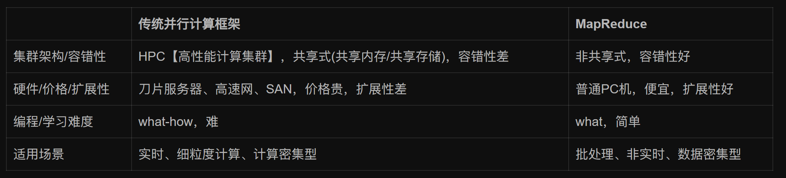
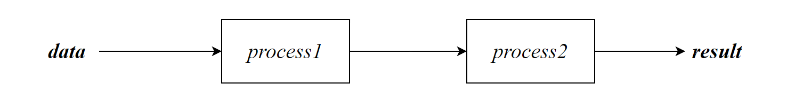
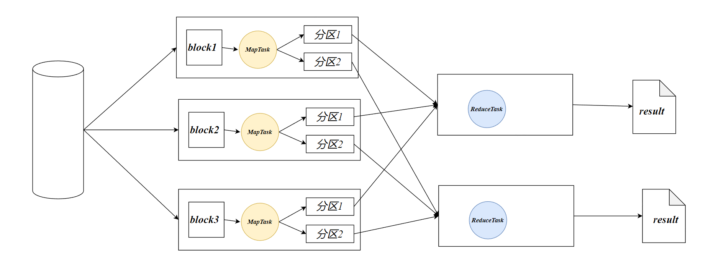
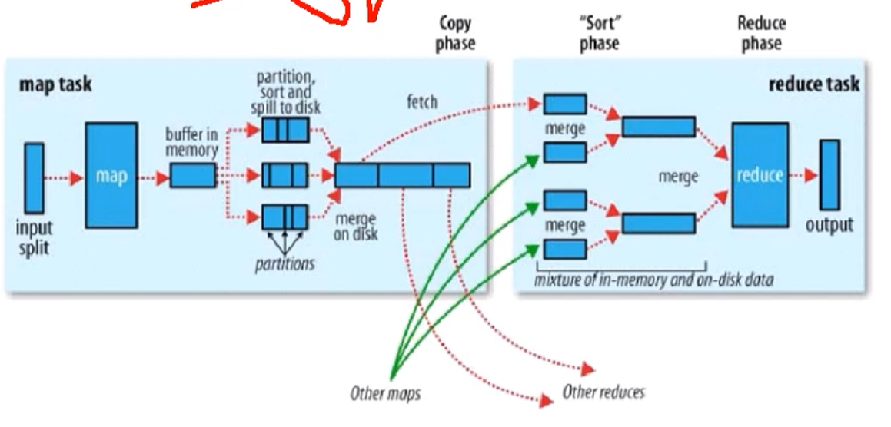
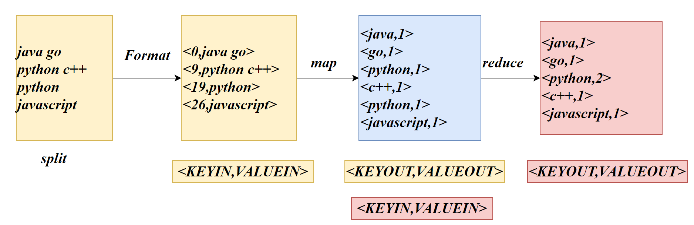
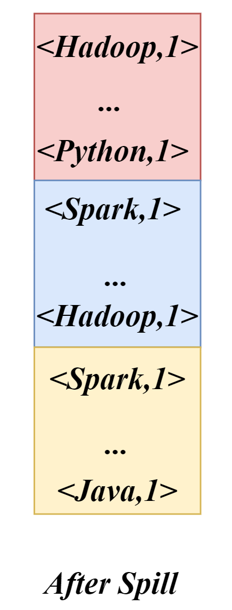
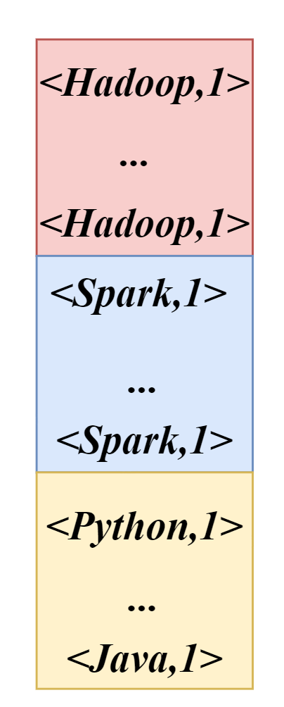
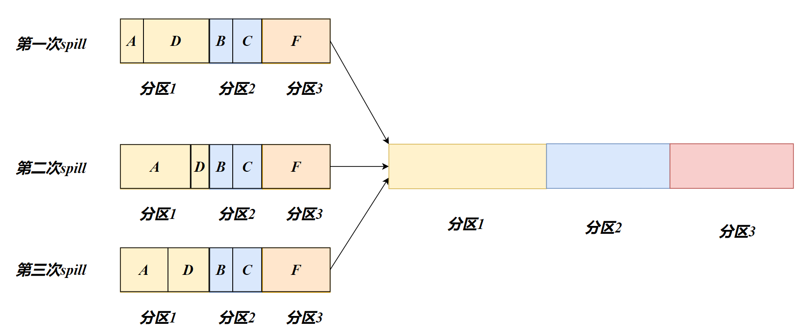

# MapReduce

## 计算框架对比



**摩尔定律**：CPU性能大约每隔18个月翻一番，从2005年逐渐失效

**分布式并行编程**：当人们不再把性能寄托在CPU提升上，人们开始借助分布式并行编程来提高程序的性能。分布式并行程序运行在大规模计算机集群上，充分利用集群的并行处理能力。

## I/O密集型

"IO密集型"（I/O-bound）是指在执行过程中主要受制于（I/O）操作速度的一类计算任务。

MapReduce从磁盘或从网络读写 数据，即IO密集工作

MapReduce需要计算数据，即CPU密集工作 

## MapReduce定义

MapReduce是一个分布式计算程序的编程框架。

MapReduce核心功能是将用户编写的业务逻辑代码和自带默认组件整合成一个完整的分布式运算程序，并发运行在一个Hadoop集群上。

## MapReduce优点

- MapReduce易于编程

简单的实现一些接口，就可以完成一个分布式程序，这个分布式程序可以分布到大量廉价的PC机器上运行。也就是说你写一个分布式程序，跟写一个简单的串行程序是一模一样的。就是因为这个特点使得MapReduce编程变得非常流行。

- 良好的扩展性

当你的计算资源不能得到满足的时候，你可以通过简单的增加机器来扩展它的计算能力。

- 高容错性

MapReduce设计的初衷就是使程序能够部署在廉价的PC机器上，这就要求它具有很高的容错性。比如其中一台机器挂了，它可以把上面的计算任务转移到另外一个节点上运行，不至于这个任务运行失败，而且这个过程不需要人工参与，而完全是由Hadoop内部完成的。

- 适合PB级以上海量数据的离线处理

可以实现上千台服务器集群并发工作，提供数据处理能力。


## MapReduce 缺点

- 不擅长实时计算

MapReduce无法像MySQL一样，在毫秒或者秒级内返回结果。

- 不擅长流式计算

流式计算的输入数据是动态的，而MapReduce的输入数据集是静态的，不能动态变化。这是因为MapReduce自身的设计特点决定了数据源必须是静态的。常用*Flask*

- 不擅长DAG（有向无环图）计算



多个应用程序存在依赖关系，后一个应用程序的输入为前一个的输出。在这种情况下，每个MapReduce作业的输出结果都会写入到磁盘，会造成大量的磁盘IO，导致性能非常的低下。常用*Flask*

## 数据集

适合使用MapReduce处理的数据集需要满足一个前置条件：待处理的数据集可以分解成许多小的数据集，而且每一个小数据集都可以完全并行处理

## MapReduce 核心思想

以wordcount为例



相同的key聚集为一组，调用一次reduce。reduce服务器数量由人决定。默认的配置为1台reduce服务器

分布式计算需要2个阶段：

- *Map*

映射，Map阶段会并发MapTask，互不影响

Map得到结果会暂存在内存中的缓冲区中，当达到上限会写入硬盘

- *Reduce*

聚合，ReduceTask是并发执行的，他的数据依赖于上一个阶段所有MapTask的结果

- *split*

切片，一个split对应一个mapTask，默认一个切片的Szie与HDFS的blockSize相同，可以根据实际情况设置split的大小。不同数量的split将影响MapTask的数量

- *Shuffle*

洗牌，将Map得到的文件在内存中进行排序，每一个文件内部是有序的

- *partition*

分区，一个分区可以存在多个组，相同的key分区号相同。排序P->Key



## MapReduce进程

一个完整的**MapReduce**程序在分布式运行时有三类实例进程：

- **MrAppMaster**：负责整个程序的过程调度及状态协调。（Mr是MapReduce的缩写，也称*Job*）
- **MapTask**：负责Map阶段的整个数据处理流程。MapTask得到的结果存储在磁盘中
- **ReduceTask**：负责Reduce阶段的整个数据处理流程。

执行ReduceTask前需要完成MapTask

一个MapReduce编程模型只能包含一个Map阶段和Reduce阶段。如果用户的业务非常复杂，需要编写多个MapReduce程序

## Hdoop数据类型

Hadoop中使用的是自己的数据类型，与Java中的类型的关系：

| **Java**类型 | *Hadoop Writable*类型 |
| ------------ | --------------------- |
| Boolean      | BooleanWritable       |
| Byte         | ByteWritable          |
| Int          | IntWritable           |
| Float        | FloatWritable         |
| Long         | LongWritable          |
| Double       | DoubleWritable        |
| String       | Text                  |
| Map          | MapWritable           |
| Array        | ArrayWritable         |
| Null         | NullWritable          |

## MapReduce过程

1. **提交作业：** 客户端通过调用 `Job.waitForCompletion()` 提交 MapReduce 作业。这个调用触发了作业的提交，并将**作业的 Jar 文件和配置提交到 Hadoop 集群**上。
2. **资源分配：** ResourceManager 负责作业的资源管理。它决定在哪些节点上启动任务（Map 和 Reduce 任务）。任务调度器将任务分配给可用的节点，考虑到节点的负载和数据分布。
3. **任务启动：** 一旦任务被分配到节点，NodeManager 在该节点上启动相应的 Map 或 Reduce 任务。这些任务运行在 Hadoop 集群中的分布式环境中。
4. **Map 阶段：** Map 任务处理输入数据并生成一系列键值对，然后将这些键值对按照键进行排序和分区。中间结果被写入磁盘以供 Reduce 阶段使用。
5. **Shuffle 阶段：**处于Map和Reduce中间的阶段。这个阶段包括数据的排序、分组和传输。
6. **Reduce 阶段：** Reduce 任务按组处理中间键值对，并生成最终的输出。Reduce 任务的输出被写入指定的输出路径。

# MapReduce 编程规范

## KEY-VALUE一览



## Path类

在mapreduce的编程中需要将路径全部创建成一个对象，

```java
new Path(path)
```

- path：*String*，路径

支持两种路径：本地路径(`file:///`)，hdfs路径(`hdfs:///`)

本地路径格式：需要使用绝对路径，支持Windows和Linux的路径

- 在java-jar的命令中默认使用的是本地文件系统
- 在hadoop jar的命令中默认使用的是hdfs系统

防止出错可以直接显式指定文件协议类型

## Mapper类

我们需要编写一个mapper类继承Mapper，并重写map方法。每一行将调用一次map方法

```java
public class Mapper<KEYIN, VALUEIN, KEYOUT, VALUEOUT> 
```

- KEYIN：map阶段，输入的key的类型
- VALUEIN：map阶段，输入的value类型
- KEYOUT：map阶段。输出的key的类型
- VALUEOUT：map阶段，输出的value类型

类型需要使用Hadoop 中定义的类型

---

一个key调用一次map方法：

```java
void map( key,  value, context) 
```

- key：*KEYIN*，输入的key
- value：*VALUEIN*，输入的value
- context：*Context*，上下文，用于连接reduce

context中存在方法write用于输出mapper阶段的结果

```java
context.write(KEYOUT,VALUEOUT)
```

> **Example**
>
> ```java
> public class WordMap extends Mapper<LongWritable, Text,Text, IntWritable> {
>     @Override
>     protected void map(LongWritable key, Text value, Context context) throws IOException, InterruptedException {
>         String[] lines = value.toString().split(" ");
>         for (String word : lines) {
>             context.write(new Text(word),new IntWritable(1));
>         }
>     }
> }
> ```
>
> 

## Reducer类

Reducer将Mapper阶段得到的结果聚合

我们需要编写一个reducer继承*Reducer*，且重写reduce方法。

```java
public class Reducer<KEYIN,VALUEIN,KEYOUT,VALUEOUT>
```

- KEYIN：reduce阶段，输入的key的类型
- VALUEIN：reduce阶段，输入的value类型
- KEYOUT：reduce阶段。输出的key的类型
- VALUEOUT：reduce阶段，输出的value类型

---

相同的key调用一次reduce方法：

```java
void reduce( key, Iterable<VALUEIN> values, Context context) 
```

- key：*KEYIN*，输入的key
- values：*Iterable<VALUEIN>*，该key的所有value值
- context：*Context*，上下文，用于写出reduce的结果

context中存在方法write用于输出reduce阶段的结果

通过实现 `Iterable` 接口，表明`values`是可迭代的，即可以使用增强的 for 循环或者显式地使用迭代器来遍历其元素。

> **Example**
>
> ```java
> public class WordReduce extends Reducer<Text, IntWritable, Text,IntWritable> {
>     @Override
>     protected void reduce(Text key,Iterable<IntWritable>values,Context context) throws IOException, InterruptedException {
>         int sum=0;
>         for (IntWritable value : values) {
>             sum=sum+value.get();
>         }
>         context.write(key, new IntWritable(sum));
>     }
>    }
>    ```
>    
> 


## Main

Main是程序的入口，也称为驱动

> **Example**
>
> ```java
> public class WordMain {
>  public static void main(String[] args) throws IOException, InterruptedException, ClassNotFoundException {
> 
>      Configuration config = new Configuration();
>      Job job = Job.getInstance(config);
>      job.setJarByClass(WordMain.class);
>      job.setMapperClass(WordMap.class);
>      job.setReducerClass(WordReduce.class);
>      //map输出的kv类型
>      job.setMapOutputKeyClass(Text.class);
>      job.setMapOutputValueClass(IntWritable.class);
> 
>      //最终的K,V
>      job.setOutputKeyClass(Text.class);
>      job.setOutputValueClass(IntWritable.class);
>      
>      //设置输入和输出的Format路径
>     FileInputFormat.setInputPaths(job, new Path(args[0]));
>     FileOutputFormat.setOutputPath(job, new Path(args[1]));
>      //提交job
>      boolean result = job.waitForCompletion(true);
>      System.exit(result?0:1);
>  }
> ```
>
> 


## 两种运行方式

在Maven中package形成jar包，默认不会将第三方的依赖也注入。

- `java -jar`

在idea中能够运行是因为存在hadoop -client的依赖（本地模式，resourceManager没有记录）

在本地模式下，整个MapReduce作业将在单个主机上运行，而不涉及整个Hadoop集群。这对于开发和调试MapReduce程序是非常方便的。

- `hadoop jar`

当使用hadoop jar 命令，hadoop安装目录中存在相关的依赖，因此可以正常执行，mapreduce程序会交给mapreduce进行计算，resourceManager中可以找到相关记录

```sh
hadoop jar yourmapreducejob.jar inputPath outputPath
```

## Writable

在Hadoop中，序列化与反序列化采用的是自己的*Writeable*接口，而不使用Java的*Serializable*接口，因为Java的接口中存在较多的冗余信息，而在hadoop集群内进行通信，不需要那么多的安全机制。

实现Writeable接口，并且重写序列化方法write，反序列化方法readField

序列化和反序列化的顺序需要相同。例如：upFlow->downFlow->sumFlow

```java
    @Override
    public void write(DataOutput dataOutput) throws IOException {
        dataOutput.writeLong(upFlow);
        dataOutput.writeLong(downFlow);
        dataOutput.writeLong(sumFlow);

    }

    @Override
    public void readFields(DataInput dataInput) throws IOException {
        this.upFlow = dataInput.readLong();
        this.downFlow = dataInput.readLong();
        this.sumFlow = dataInput.readLong();

    }
```


## Partitioner

Partitioner主要用于自定义规则令相应的key进入相应的分区中

### HashPartitioner

默认的分区计算公式：$hash(key)mod R$，R为ReduceTask的数量。用户在默认模式下无法决定key存放在指定分区。

分区号是从1开始的。

### MyPartitioner

我们继承`Partitioner`并重写 `getPartition()`

```java
abstract class Partitioner<KEY, VALUE> 
```

- *KEY*，mapTask输出的key的类型
- *VALUE*，mapTask输出的value的类型

```java
abstract int getPartition(KEY key, VALUE value, int numPartitions)
```

- `key`：待分区的key
- `value`：待分区的value
- `numPartitions`：分区的总数量
- `Return`：*Int，*分区号


注册分区规则：

```java
Job.setPartitionerClass(MyPartitioner.class)
```

设置分区数量：

```java
job.setNumReduceTasks(num)
```

- num：*Integer*，ReduceTask的数量

---

> Example：
>
> ```java
> public class MyPartitioner extends Partitioner<Text,Flow> {
>     @Override
>     public int getPartition(Text text, Flow flow, int numPartitions) {
>         String phone = text.toString();
>         String prePhone = phone.substring(0, 3);
>         int partition;
>         switch (prePhone) {
>             case "136":
>                 partition = 0;
>                 break;
>             case "137":
>                 partition = 1;
>                 break;
>             case "138":
>                 partition = 2;
>                 break;
>             case "139":
>                 partition = 3;
>                 break;
>             default:
>                 partition = 4;
>                 break;
>         }
>         return partition;
> 
>     }
> 
> ```
>
> 


## WritableComparable

在Hadoop的shuffle中需要对key进行排序（Map端快排，Reduce端归并排序）。因此shuffle的key必须是Comparable的


WritableComparable需要实现Writeable相关的方法外，还需要实现Comparable有关的方法。即WritableComparable是Writeable和Comparable的共同得到的一个接口。

WritableComparable存在泛型，为比较对象的种类

```
public class Flow  implements WritableComparable<Flow> 
```

需要实现`compareTo`方法

```java
    @Override
    public int compareTo(Flow o) {
        //总流量的倒序
        if (this.sumFlow>o.sumFlow){
            return -1;
        } else if (this.sumFlow<o.sumFlow) {
            return 1;
        }else {
            //根据upFlow进行正序排序
            if (this.upFlow>o.upFlow){
                return -1;
            }
            else if (this.upFlow<o.upFlow){
                return 1;
            }
            else {
                return 0;
            }
        }
    }
```

## Combiner

Combiner为Shuffle中可选的一个过程，Combiner位于Map端的Shuffle溢写的归并之后的过程

Combiner是一种**局部聚合**（在分区内），因此他的父类为Reducer。

```java
<java,1>,<java,1>--><java,2>
```

```java
job.setCombinerClass(MyCombiner.class)
```

```java
public class WordCombiner extends Reducer<Text, IntWritable,Text,IntWritable> {
    @Override
    protected void reduce(Text key, Iterable<IntWritable> values, Reducer<Text, IntWritable, Text, IntWritable>.Context context) throws IOException, InterruptedException {
        int sum=0;
        for (IntWritable value : values) {
            sum+=value.get();
        }
        IntWritable res = new IntWritable();
        res.set(sum);
        context.write(key,res);
    }
}
```

执行了Combiner后可以发现`Reduce Shuffle bytes`的大小减少了

使用Combiner的前提是不影响MapReduce的逻辑（局部聚合后不影响Reducer阶段的逻辑，简单的判断方法就是如果Combiner和Reducer的reduce方法相同，就不会有影响）

如果Combiner的逻辑与Reducer的逻辑相同，实际上可以不写Combiner类，直接使用Reducer的子类进行注册

```java
job.setCombinerClass(WordReducer.class)
```

## OutputFormat

OutputFormat是抽象类。是MapReduce的输出基类。MapReduce默认的输出类是TextOutputFormat

如果想要将结果的输出到指定文件，我们需要自定义FileOutputFormat的子类


- 注册

```java
job.setOutputFormatClass(LogOutputFormat.class)
```


# MapReduce 原理

## 计算向数据靠拢

数据的移动需要大量的网络传输开销，尤其是在集群中，因此MapReduce会将Map程序就近地在HDFS数据所在的节点运行。

## MapTask

MapTask的个数决定了程序的并行度，MapTask的数量决定于Split分片的数量。


## Split

分片，Split是对block进行逻辑切分，并不会进行物理切分。如果输入存在多个文件，则split的过程是针对每个单独的文件进行的。

# Shuffle

Shuffle（洗牌）是指对Map任务输出的结果进行分区、排序、合并、归并并交给Reduce的过程

## Map端Shuffle

### 写入缓存

每个MapTask都会被分配一个缓存，Map的输出结果并不是立即写入磁盘。而是首先写入缓存，在缓存中积累到一定的程度会一次性写入磁盘（减少IO资源的使用）


### 溢写（Spill）

缓存区的大小默认为100MB，随着MapTask的进行，缓存中的内容会不断增多，这时会启动溢写（**内容快溢出缓存的上限，而进行写出数据**）。为保证Map结果能够持续写入缓存（1一个MapTask只有1个缓冲区），当达到缓存的80%（默认比例）就会启动溢写。

#### 排序

MapTask最终的结果为一个大文件。如果直接将溢写结果原始输出将会得到这样的数据：




Spill原始的输出中，不同的Key随机分布在文件的不同的地方。因为Reduce需要对同1个Key执行一次reduce方法。因此Reduce需要从头开始搜索相应的key，且每一个reduce都需要这样。这样的效率是非常低下的

这就引出的spill的**排序算法**：

我们希望得到的大文件是有序的，这样Reduce只需要知道指定key的偏移量就可以结束读取



#### 分区

> 注意：溢写的过程应该是先分区再排序


Reduce服务器资源有限，一个ReduceTask必定会执行多个key相关的任务。一次reduce执行一个key的数据，如果每次只拉取一个key，则需要重复地从Map端拉取不同的key执行Reduce，这需要大量的网络IO资源

我们希望reduce在拉取mapper的结果时一次性拉取多个不同的key，这样可以节省资源。

多个不同的key就共同构成了一个分区（*Partitioner*）。每次Reduce拉取数据时以分区为单位

相同的key的分区号是相同的（在其他的MapTask也相同）。

因此我们可以先对数据进行分区，然后再进行分区内排序（相同key排在一起），得到一个有序的数据集：



一个分区被一个Reduce处理，生成一个输出文件（*partXXX*）


### 归并

将spill排序、分区后的磁盘上的文件，我们需要将其合并成一个文件

最终生成一个存储在本地磁盘的大文件，这个文件中的数据是被分区的，不同的分区会被发送到不同的ReduceTask中。相同的分区会被送至同一个Reduce中

当监测到一个MapTask任务完成后，会立即通知相关的ReduceTask来领取数据，然后在Reduce端执行Shuffle


## Reduce 端Shuffle

### Fetch

Fetch领取，从MapTask所在节点拉取指定分区。一个分区中存在多个key相关的数据


### 归并

从Map端得到的数据会被存放至Reduce所在的缓存中，当达到缓存上限时也会触发溢写机制。在溢写的过程中

会对来自不同map端的分区数据进行排序。由于在Map端已经对分区内的key进行了排序。因此归并排序的速度很快。最终形成一个大文件，大文件中相同key全部排序在了一起，相当于形成了`<key,List<value>>`的数据结构。

排序后的文件在reduce端可以做到**高效率的写入**（判断key是否相等，即可知道该组key的范围）


# Join

类似于Mysql中的join

Mapper中的setup，每次切片（MapTask）将执行1次setup方法进行初始化

## Reduce Join

Map端的主要工作：为来自不同表或文件的key/value对，打标签以区别不同来源的记录。然后用连接字段作为key，其余部分和新加的标志作为value，最后进行输出。

Reduce端的主要工作：在Reduce端以连接字段作为key的分组已经完成，我们只需要在每一个分组当中将那些来源于不同文件的记录（在Map阶段已打标志）分开，最后进行合并即可完成连接。

## DistributedCache

**分布式缓存：** MapReduce任务可以通过分布式缓存（Distributed Cache）机制将小型文件（比如配置文件、字典文件等）**本地化到任务节点**。这些文件会在任务执行之前被复制到每个节点的本地文件系统中，从而减少任务在运行时对这些文件的访问成本。

```java
job.addCacheFile(new URI("file:///input/join/pd.txt"));
```

```java
  /**
   * 添加要本地化的缓存文件
   * @param uri 要本地化的缓存文件的 URI
   */
  public void addCacheFile(URI uri) {
    // 确保作业处于定义状态
    ensureState(JobState.DEFINE);
    
    // 使用 DistributedCache.addCacheFile 方法将缓存文件添加到配置中
    DistributedCache.addCacheFile(uri, conf);
  }
```

---

- **本地文件缓存（addCacheFile）：** 当缓存文件位于客户端当前运行的节点中，可以使用 `addCacheFile` 方法将缓存文件分发到所有 Map 任务的本地工作目录（作业结束后将消失）。这样，每个 Map 任务都可以访问这个本地缓存文件。这在一些场景下是比较适用的，尤其是当文件相对较小，可以被复制到每个节点而不引起太多开销时。

```java
javaCopy code// 示例代码
job.addCacheFile(new URI("file:///path/to/local/cache/file.txt"));
```

- **HDFS 文件直接读取：** 如果缓存文件在 HDFS 中，你可以在 MapReduce 任务的 `setup` 方法中直接读取这个文件，而不需要使用 `addCacheFile`。因为 Hadoop 会自动将 HDFS 中的文件分发到所有节点。

```java
javaCopy code// 示例代码
Path hdfsCacheFile = new Path("hdfs:///path/to/hdfs/cache/file.txt");
FileSystem fs = FileSystem.get(context.getConfiguration());
FSDataInputStream fis = fs.open(hdfsCacheFile);
BufferedReader reader = new BufferedReader(new InputStreamReader(fis, StandardCharsets.UTF_8));

// 逐行读取文件内容
String line;
while ((line = reader.readLine()) != null) {
    // 处理每一行的逻辑
}
```

总体而言，`addCacheFile` 适用于本地文件，而对于 HDFS 中的文件，你可以直接在 Map 任务的 `setup` 方法中读取它们，无需手动添加到缓存。

## Map Join

在Reduce端处理过多的表，非常容易产生数据倾斜，造成Reduce端的负载过大。Map Join适用于一张表十分小、一张表很大的场景。

在Map端缓存多张表，提前处理业务逻辑，这样增加Map端业务，减少Reduce端数据的压力，尽可能的减少数据倾斜。

---

为什么要在Main类添加本地文件？因为Main类是运行在客户端所在的当前节点上的，其他节点可能不存在该文件，如果在setup中读取本地文件，MapTask的节点并不存在该文件，因此我们需要使用分布式缓存机制进行广播。

可以使用 `java.io` 直接读取文件，而不必依赖 Hadoop 的文件系统和相关类。在这个特定的场景中，使用 Hadoop 的 `FileSystem` 和 `FSDataInputStream` 可能是因为你的数据可能分布在HDFS中，而 Hadoop 提供了方便的 API 用于处理这种情况。

如果你的数据是本地文件系统中的常规文件，而不是分布式文件系统中的数据，那么你可以考虑使用 Java 标准库中的 `FileInputStream` 和 `BufferedReader`。

```java
        Configuration conf = new Configuration();
        Job job = Job.getInstance(conf);
        // 2 设置加载jar包路径
        job.setJarByClass(Main.class);
        // 3 关联mapper
        job.setMapperClass(JoinMapper.class);
        // 4 设置Map输出KV类型
        job.setMapOutputKeyClass(Text.class);
        job.setMapOutputValueClass(NullWritable.class);
        // 5 设置最终输出KV类型
        job.setOutputKeyClass(Text.class);
        job.setOutputValueClass(NullWritable.class);

        // 加载缓存数据
        job.addCacheFile(new URI("file:///input/join/pd.txt"));
        // Map端Join的逻辑不需要Reduce阶段，设置reduceTask数量为0
        job.setNumReduceTasks(0);

        // 6 设置输入输出路径
        FileInputFormat.setInputPaths(job, new Path("file:///input/join/order.txt"));
        FileOutputFormat.setOutputPath(job, new Path("file:///output/join"));
        // 7 提交
        boolean b = job.waitForCompletion(true);
        System.exit(b ? 0 : 1);
    }
```

```java
public class JoinMapper extends Mapper<LongWritable, Text,Text, NullWritable> {
    private Map<String, String> pdMap = new HashMap<>();
    private final Text text = new Text();

    @Override
    protected void setup(Mapper<LongWritable, Text, Text, NullWritable>.Context context) throws IOException, InterruptedException {
        URI[] cacheFiles = context.getCacheFiles();
        Path path = Paths.get(cacheFiles[0]);
        // 使用新的文件读取方式
        try (BufferedReader reader = Files.newBufferedReader(path, StandardCharsets.UTF_8)) {
            // 逐行读取，按行处理
            String line;
            while ((line = reader.readLine()) != null) {
                // 切割一行
                String[] split = line.split("\t");
                pdMap.put(split[0], split[1]);
            }
        }
    }

    @Override
    protected void map(LongWritable key, Text value, Mapper<LongWritable, Text, Text, NullWritable>.Context context) throws IOException, InterruptedException {
        String[] line = value.toString().split("\t");
        String pName = pdMap.get(line[1]);
        text.set(line[0]+"\t"+pName+"\t"+line[2]);
        context.write(text,NullWritable.get());

    }
```


# ETL

## 概述

*ETL*，是英文*Extract-Transform-Load*的缩写。ETL常用在数据仓库，但其对象并不限于数据仓库

在运行核心业务MapReduce程序之前，往往要先对数据进行清洗，清理掉不符合用户要求的数据。清理的过程往往只需要运行Mapper程序，不需要运行Reduce程序。
