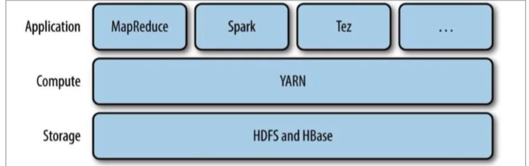
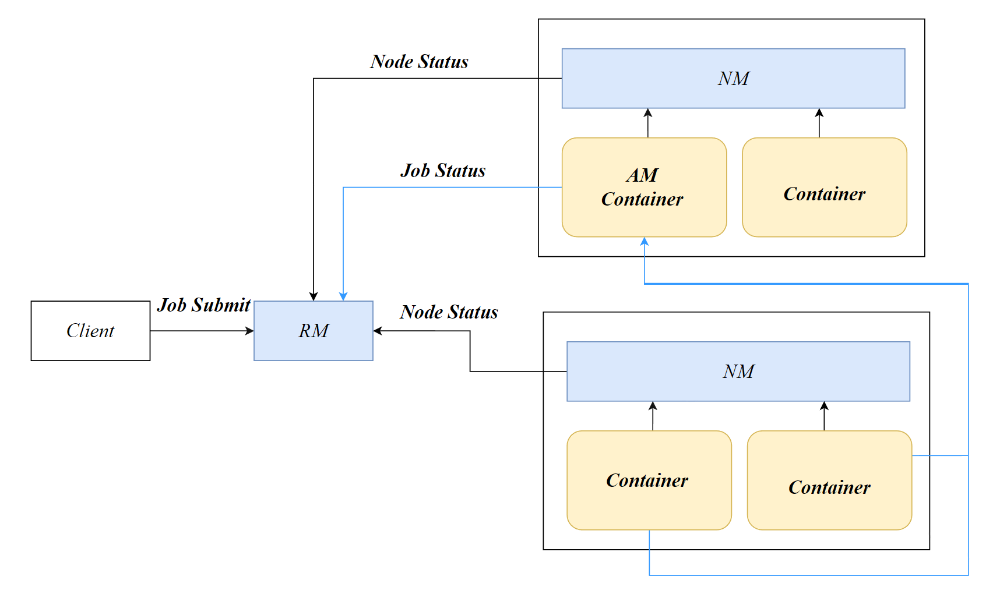
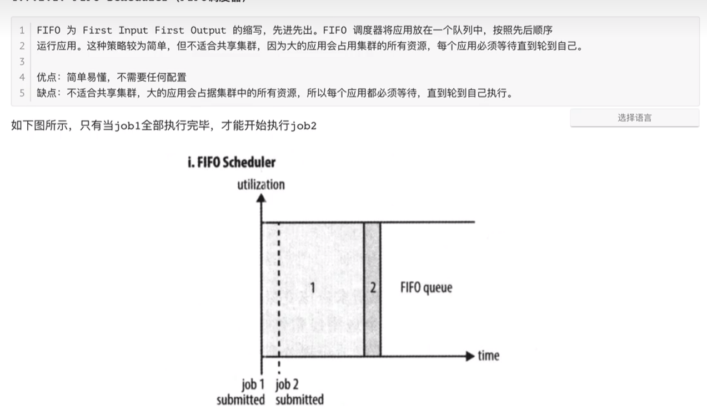
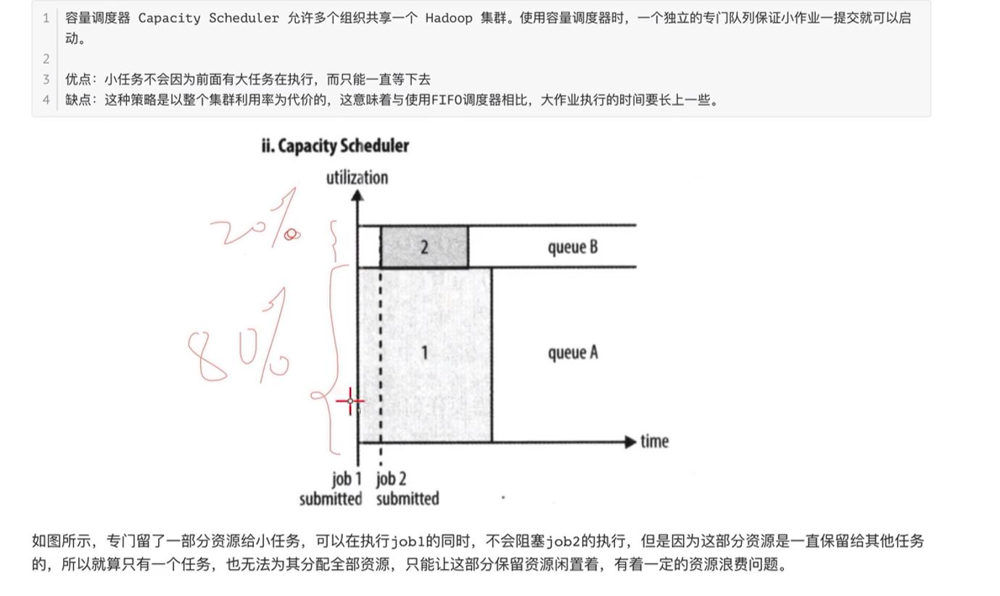
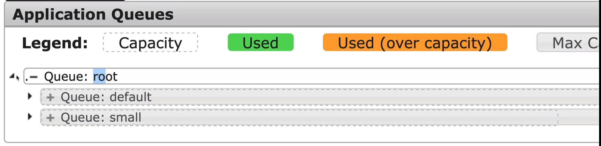
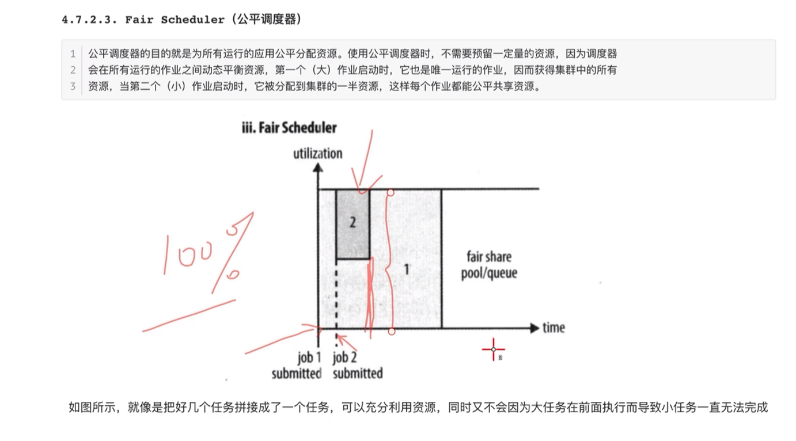

# YARN

## 资源调度概述

Yarn（*Yet Another Resource Negotiator*）是一个资源调度平台，负责为运算程序提供服务器运算资源，相当于一个分布式的操作系统平台，而MapReduce等运算程序则相当于运行于操作系统之上的应用程序。

YARN不关心Job是如何执行的，只关心各个节点的资源以及程序的执行情况。



## YARN工作流程



以MapReduce为例：

1. Client调用job.waitForCompletion方法，向RM提交MapReduce Job。
2. RM会将Job 资源的提交路径发给Client
3. Client提交Job所需要的资源：jar、config、split至RM分配的路径
4. 资源提交完毕后，Client向RM申请运行Job
5. RM分配一个NodeManager创建 AM Container，并运行AM
6. AM向RM申请资源 运行相应的MapTask
7. RM将Task分配给NodeManager，NodeManger创建容器运行Task
8. Task会向AM汇报Task的进度
9. 当所有的MapTask运行完成后，AM向RM申请运行ReducerTask
10. MR程序运行完毕后，AM向RM申请销毁自己

## 容器失败处理

如果一个任务容器由于某种原因失败，NodeManager将向ApplicationMaster报告容器的失败状态。**ApplicationMaster需要处理这些失败**，可能通过向ResourceManager请求重新分配资源来重新启动任务容器。


# Yarn架构

Apache Yarn是一个标准的Master/Slave集群（主从架构）。其中ResourceManager为Master，NodeManger为Slave

资源以Container形式分配

## ResourceManager

**资源仲裁中心**，统筹整个集群中的资源

- 负责管理各个NodeManager
- 处理客户端的Job请求
- 监视ApplicationMaster发送的Job Status
- 监视NodeManager发送的Node Status


## NodeManager

**NodeManager是ResourceManager的代理**，负责管理本机器上的计算资源。

NM根据RM命令，启动Container、监视Container的资源使用情况，并且向RM汇报资源的使用情况。

NM会定时向RM发送心跳信号

NM也会处理来自AM的命令


## ApplicationMaster

应用程序管理器，在Hadoop中也称JobMaster，作业管理器。一个*Job*存在多个Task

在MapReduce计算框架中也称为MrAppMaster。每一个应用程序都拥有一个AM，Job中存在多个Task

- AM可以向RM申请资源，并分配给内部任务。
- AM还负责统筹和 监控 Job中的Task的执行情况。

ApplicationMaster实际上是运行在AM Container上的。NameNode根据RM的命令创建了一个AM Container，并在其中运行AM进程。这个NameNode由ResourceManager选择。


# Resource Scheduler

Resource Scheduler是Resource Manager中的一个程序，负责集群资源的分配与调度

## FIFO调度器




## 容量调度器

### Capacity Scheduler

YARN默认采用的调度策略



队列占用的资源并不是固定的，繁忙的队列可以向空闲的队列借用资源。资源不能超过队列的最大资源上限（*maximum-capacity*）。

当被借用资源的队列有任务进入时，借用者必须立即归还借用的资源。

### 队列配置

在/etc/hadoop/capacity-scheduler.xml中可以设置容量调度器的队列信息，默认只有default一个队列

```xml
<!-- 添加自定义队列的名字，使用逗号分隔 -->
  <property>
    <name>yarn.scheduler.capacity.root.queues</name>
    <value>default</value>
    <description>
      The queues at the this level (root is the root queue).
    </description>
  </property>
<!-- 队列占用的默认资源百分比 -->
  <property>
    <name>yarn.scheduler.capacity.root.default.capacity</name>
    <value>100</value>
    <description>Default queue target capacity.</description>
  </property>
<!-- 队列从其他空闲队列借用资源后，能够达到的最大资源占比-->
  <property>
    <name>yarn.scheduler.capacity.root.default.maximum-capacity</name>
    <value>100</value>
    <description>
      The maximum capacity of the default queue. 
    </description>
  </property>
<!-- 队列是否激活（RUNNING） -->
  <property>
    <name>yarn.scheduler.capacity.root.default.state</name>
    <value>RUNNING</value>
    <description>
      The state of the default queue. State can be one of RUNNING or STOPPED.
    </description>
  </property>
```

我们仿照default队列的配置，添加一个新的队列queue2

- 添加队列

```xml
<!-- 添加自定义队列的名字，使用逗号分隔 -->
  <property>
    <name>yarn.scheduler.capacity.root.queues</name>
    <value>default,queue2</value>
  </property>
```

- 配置队列默认占用的资源

```xml
<!-- 队列占用的默认资源百分比 -->
  <property>
    <name>yarn.scheduler.capacity.root.queue2.capacity</name>
    <value>20</value>
  </property>
```

- 配置队列最大能够占用的资源

```xml
  <property>
    <name>yarn.scheduler.capacity.root.queue2.maximum-capacity</name>
    <value>30</value>
  </property>
```

- 激活队列

```xml
  <property>
    <name>yarn.scheduler.capacity.root.queue2.state</name>
    <value>RUNNING</value>
  </property>
```

队列配置文件修改后，需要重启Yarn

### **Application Queues** Web UI



指定Job运行在指定的队列中

```sh
hadoop jar Application -Dmapreduce.job.queuename=队列名
```


## 公平调度器



