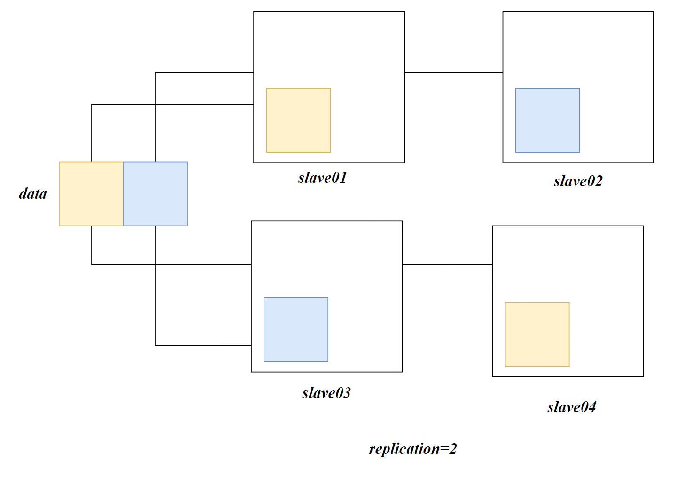
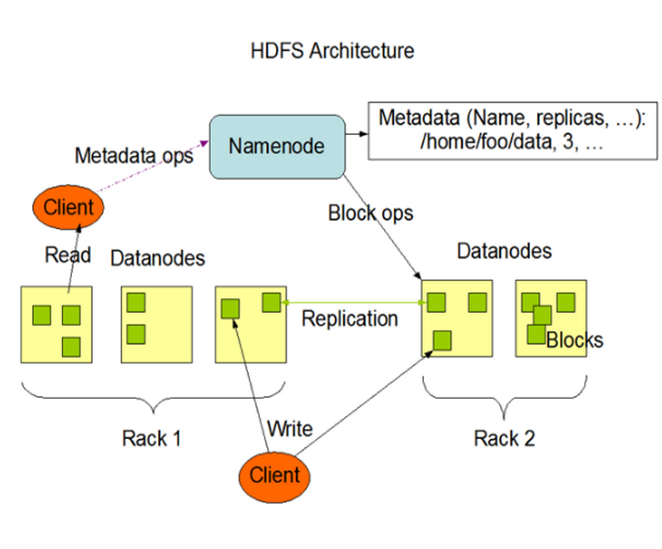

# HDFS概述

## 概述

Hadoop Distributed File System，Hadoop分布式文件系统。HDFS用于解决数据的海量存储问题

HFDS适合一次写入，多次读出的场景。一个文件经过HDFS存储后，就无法对其在进行修改，但是可以在末尾进行追加数据。

## HDFS优点

- 高容错性

数据自动保存多个副本，他通过增加副本的形式，提高容错率

当某一个副本丢失以后，它会从其他副本复制进行自动修复



- 适合处理大数据

数据规模：能够处理PB级别的数据

文件规模：能够处理百万规模以上的文件数量

- 由于hafs的副本机制，其可以部署在廉价服务器上，因为服务器的稳定性要求不高

## HDFS缺点

- 不适合低延时的数据访问，无法做到毫秒级别的读取数据
- 无法高效地对大量小文件进行存储。小文件的存储会占用namenode大量的存储来存储元数据，namenode的内存总是有限的
- 不支持并发的读写，一个文件只能有一个写，不允许多个线程同时写
- 仅支持数据的append操作，不支持文件的随机修改

## HDFS组成



### NameNode

Master，HDFS的管理者。他负责：

- 管理HDFS的名称空间
- 配置副本策略
- 管理block的映射信息
- 处理客户端（web、CLI）的读写请求


### DataNode

NameNode下达命令，DataNode执行实际的操作

- 负责存储实际的数据块
- 执行数据块的读/写操作

### Client

客户端

- 文件上传至HDFS的时候，Client将文件切分成一个个的block，然后进行上传
- 客户端可以从namenode处获得文件的位置信息
- 客户端与datanode交互，执行读写操作
- 客户端供用户输入命令对HDFS进行管理

### SecondaryNameNode

NameNode的冷备份，当NameNode挂掉后，并不能替换NameNode提供服务

他只能辅助NameNode，分担其工作量。在紧急情况下，辅助NameNode恢复有限的数据

## Block

数据在HDFS中以块的形式存储，一个数据可以被分成多个块，如果没有达到一个块大小，其就占用一个块。

在Hadoop 1中 Block的默认大小为64MB，Hadoop2/3提升到了128MB

>  为什么块大小默认设置成128MB？
>
> 寻址的最佳时间为10ms，寻址时间为传输时间的1%时为最佳状态，因此数据传输的时间应该为1s
>
> 而目前磁盘的传输速率普遍在100MB/s
>
> 则一个block大小应该为100MB，最终选择128MB


HDFS的块设置过小会造成寻址时间的增加。HDFS的块设置过大，会导致分布式计算停滞在某一个块

HDFS的大小主要取决于磁盘的传输速度

## replication

文件在hdfs中的副本数量，通常情况下，一个服务器只会保存一个块的一个副本，因为重复存储没有意义。

服务器挂掉，则这个服务器上的所有副本都会丢失，所以一个节点不会存储相同的块。

如果只有3个服务器存在datanode，块副本数量最多存储3份，如果设置超过服务器datanode的实际情况，也只会存在3个副本，当服务器扩容时，hdfs则会自动复制副本以达到目标副本数量

# Shell

将hadoop fs 设置别名：hdfs

```sh
alias hdfs='hadoop fs'
```

## 上传

- 从本地移动文件至hdfs

```sh
hdfs -moveFromLocal  loaclpath hdfspath
```

- 从本地复制文件至hdfs

```sh
hdfs -copyFromLocal  loaclpath hdfspath
```

- 与copyFromLocal等价

```sh
hdfs -put loaclpath hdfspath
```

- 追加一个文件至已存在的文件末尾

```sh
hdfs -appendToFile localpath hdfspath
```

## 下载

- 从HDFS拷贝至本地

```sh
hdfs -copyToLocal hdfspath localpath
```

- 等价于copyToLocal

```sh
hdfs -get  hdfspath loaclpath
```


## HDFS直接操作

- 显示目录信息

```sh
hdfs -ls  hdfspath
```

- 显示文件内容

```sh
hdfs -cat hdfspath
```

- 创建路径

```sh
hdfs -mkdir path
```

- 拷贝内容

```sh
hdfs -cp src dest
```

- 移动内容

```sh
hdfs -mv src dest
```

- 显示末尾1KB的数据

```sh
hdfs -tail path
```

- 删除文件/文件夹

```sh
hdfs -rm path
```

- 递归删除目录以及目录中的内容

```sh
hdfs -rm -r path
```

- 统计文件夹的大小信息

```sh
hdfs -du -s -h path
```

```sh
hdfs -du -s -h /input
```

> 1.3 K  4.0 K  /input


第一个结果表示该文件/文件夹的大小

第二个结果表示该目录存在多个副本，占用的磁盘大小为$1.3K*3=4K$

# API

## 创建客户端对象

```java
URI uri = new URI("hdfs://master:8020");
Configuration config = new Configuration();
config.set("dfs.client.use.datanode.hostname", "true");//以hostanme进行通信，适用于docker环境
FileSystem fs = FileSystem.get(uri, config,"root");
//执行操作
fs.mkdirs(new Path("/input/idea"));
fs.close();
```

> *Docker*注意项
>
> 在docker compose中我们设置了datanode的端口为9866。当我们在windows环境下访问 datanode:9866会被静态DNS解析成centos:9866，根据docker容器的端口映射，其会访问docker中的master:9866。根据Hadoop的datanode同步机制，其会向其他datanode复制到指定副本数量
>
> 弊端：
>
> master永远都会存储一份block，截止2023/11/26尚未想到处理方案

## config

在Java的resources中也可以编写hadoop的配置文件。

配置文件的优先级：$ default</etc/hadoop<resources<java代码中的配置$

以配置replication为例：

- `default`

默认的replication=3，默认配置不需要配置

- `/etc/hadoop/hdfs-site.xml`

```xml
<?xml version="1.0" encoding="UTF-8"?>
<?xml-stylesheet type="text/xsl" href="configuration.xsl"?>
<configuration>
    <property>
        <name>dfs.replication</name>
        <value>1</value>
    </property>
</configuration>
```

- `resources`

```xml
<?xml version="1.0" encoding="UTF-8"?>
<?xml-stylesheet type="text/xsl" href="configuration.xsl"?>
<configuration>
    <property>
        <name>dfs.replication</name>
        <value>1</value>
    </property>
</configuration>
```

- `java`

```java
Configuration config = new Configuration();
config.set("dfs.replication","10");
```

如果上述配置都存在，最终的replication=10

## 常见命令

### 上传

从Windows本地复制文件至指定的hdfs path

```java
fs.copyFromLocalFile(delsrc,overwrite,srcpath,destpath)
```

- `delsrc`：*Boolean*，是否删除源文件
- `overwrite`：*Boolean* ，如果destpath中存在相同名的文件，是否允许覆盖
- `srcpath`：*Path*，客户端本地的源路径
- `destpath`：*Path*，hdfs的目标路径

```java
fs.copyFromLocalFile(false,false,new Path("C:\\Users\\zuric\\Desktop\\Project\\hello.txt"),
                     new Path("/input/idea"));

```

### 下载

```java
fs.copyToLocalFile(delSrc,srcpath,destpath,useRawLocalFileSystem)
```

- delSrc ：*Boolean*，是否删除源文件
- srcpath：*Path*，源路径
- destpath：*Path*，目标文件夹路径
- useRawLocalFileSystem：*Boolean*，是否本地校验，*true*将不会生成CRC文件

在destpath中将得到两个文件：

- 源文件
- 源文件.crc：*CRC*校验文件，用于校验数据传输后是否正确

```java
fs.copyToLocalFile(false,new Path("/input/idea/hello.txt"),new Path("./get"),true);
```


### 删除

```java
fs.delete(path,b);
```

- `path`：*Path*，待删除的文件路径
- `b`：*Boolean*，是否递归删除，当目录非空需要递归删除

```java
fs.delete(new Path("/input/idea/hello.txt"),false);
```

### rename

移动文件或重命名：

```java
fs.rename(path1,path2)
```

`path1`：*Path*，源路径

`path2`：*Path*，目标路径

```java
 fs.rename(new Path("/input/idea/hello2.txt"),new Path("/input/idea/hello.txt"));
```


## 获取hdfs详细信息

```java
fs.listFiles(path, recursive);
```

- `path`：*Path*，查看的路径
- `recursive`：*Boolean*，是否迭代
- *Return*：*RemoteIterator<LocatedFileStatus>*，迭代器对象

```java
  //获取迭代器
        RemoteIterator<LocatedFileStatus> listFiles = fs.listFiles(new Path("/"), true);
        //遍历
        while (listFiles.hasNext()){
            LocatedFileStatus fileStatus=listFiles.next();
            System.out.println(fileStatus.getPath());
            System.out.println(fileStatus.getPermission());
            System.out.println(fileStatus.getOwner());
            System.out.println(fileStatus.getLen());
            System.out.println(fileStatus.getModificationTime());
            System.out.println(fileStatus.getReplication());
            System.out.println(fileStatus.getBlockSize());
            System.out.println(fileStatus.getPath().getName());
            System.out.println(Arrays.toString(fileStatus.getBlockLocations()));
        }
```

- `getPath`获取路径

```java
hdfs://centos:8020/input/idea/hello.txt
```

- `getPermission` 获取权限

```java
rw-r--r--
```

- `getOwner`获取拥有者

- `getModificationTime`获取修改时间，得到的是时间戳

- `getReplication`获取副本数量

- `getBlockSize`获取块大小

- `getBlockLocations`获取块信息，Return得到的是Array

  ```java
  [offset,length,datanode1,datanode2,...]
  ```

  - `offset` 块的起始偏移
  - `length` 块大小，单位为B
  - `datanode`块所在的host

  ```java
  [0,134217728,slave01,slave02, 134217728,134217728,slave02,master, 268435456,134217728,slave02,slave01, 402653184,89715035,slave02,master]
  ```

### 文件/目录判断

获得path下的文件状态列表

```java
fs.listStatus(path)
```

- `path`：*Path*，路径
- `Return`：*FileStatus[]*，文件状态数组

*FileStatus*：

`isFile()`：是否是文件

```java
        FileStatus[] fileStatuses = fs.listStatus(new Path("/input/idea"));
        for (FileStatus status : fileStatuses) {
            System.out.println(status.getPath());
            System.out.println("是否目录"+status.isDirectory());
            System.out.println("是否文件"+status.isFile());
        }
```


# NN和2NN


# DataNode


