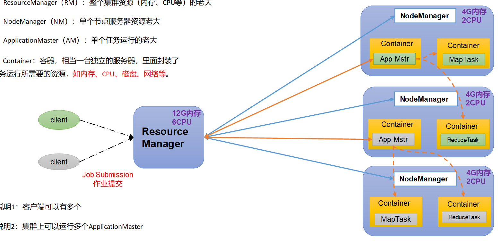
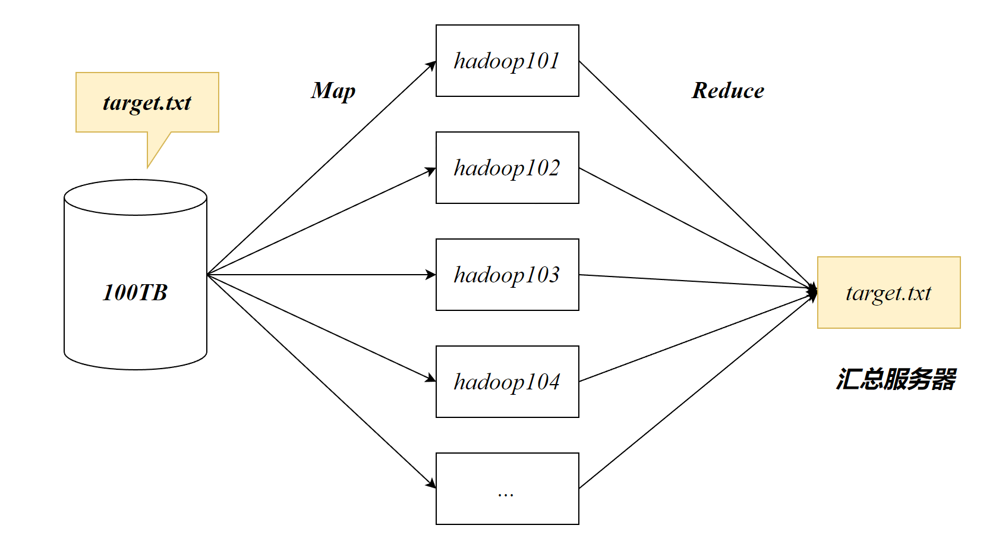

# Hadoop

## Hadoop概述

Hadoop用于解决**海量数据的存储**和**海量数据的分析计算**问题

Hadoop创建启发于Google的三篇论文：

- Bigtable
- File-System（GFS）
- MapReduce

## Hadoop生态圈

# HDFS

分布式数据存储系统 Hadoop Distributed File System

## NameNode

NameNode记录 数据都存储在什么位置

存储文件的元数据：例如文件名、文件目录结构，文件属性，每个文件的块列表和块所在的datanode

##  SecondaryNamenode

NameNode 的备份，每隔一段时间对NameNode元数据进行备份

## DateNode

HDFS 集群从节点 

datanode在本地文件系统存储文件块数据，以及块数据的校验和

# YARN

负责资源的调度

YARN由ResourceManager和NodeManager两个组件构成

## ResourceManager

*ResourceManager*负责管理整个集群资源，例如内存，CPU等。

## NodeManager

*NodeManager*负责管理单个节点的资源。

## ApplicationMaster

Hadoop上的一个任务

## Container

一个独立的服务器，类似于*docker*，里面封装了任务运行时所需要的资源：内存、CPU、磁盘、网络

每个*NodeManager*可以存在多个*Container*，通常Container最少有1个CPU

# MapReduce

负责数据的计算，MapReduce将计算过程分为两个阶段：Map和Reduce

在Hadoop集群中寻找target.txt文件，会将其分发给所有的服务器同时寻找，最后将结构汇总至服务器。

## Map

Map阶段：并行处理输入数据

## Reduce

Reduce阶段：对Map结果进行汇总
