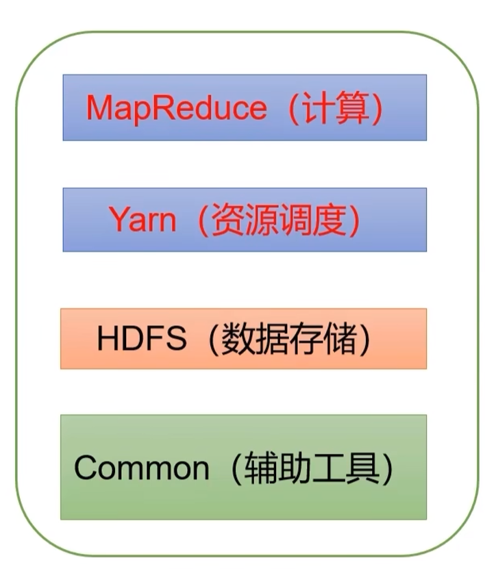

# Hadoop

## Hadoop概述

Hadoop用于解决**海量数据的存储**和**海量数据的分析计算**问题

Hadoop创建启发于Google的三篇论文：

- Bigtable
- File-System（GFS）
- MapReduce

## Hadoop生态圈

# HDFS

分布式数据存储系统 Hadoop Distributed File System

## NameNode

NameNode记录 数据都存储在什么位置

##  SecondaryNamenode

NameNode 的冷备份

## DateNode

HDFS 集群从节点 

# YARN

负责资源的调度

资源管理器MapReduce、Storm,spark,flink

## ResourceManager

## NodeManager

# MapReduce

负责数据的计算

