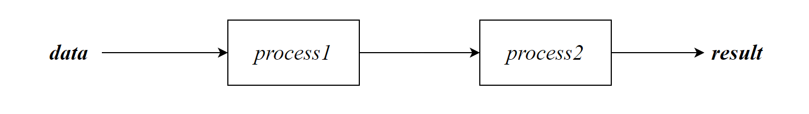
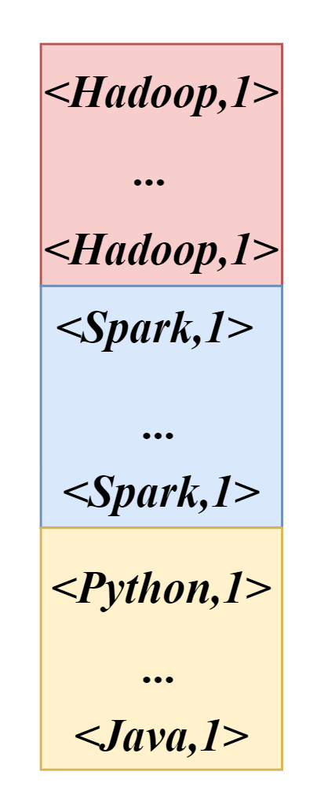

# MapReduce

## MapReduce定义

MapReduce是一个分布式计算程序的编程框架。

MapReduce核心功能是将用户编写的业务逻辑代码和自带默认组件整合成一个完整的分布式运算程序，并发运行在一个Hadoop集群上。

## MapReduce优点

- MapReduce易于编程

它简单的实现一些接口，就可以完成一个分布式程序，这个分布式程序可以分布到大量廉价的PC机器上运行。也就是说你写一个分布式程序，跟写一个简单的串行程序是一模一样的。就是因为这个特点使得MapReduce编程变得非常流行。

- 良好的扩展性

当你的计算资源不能得到满足的时候，你可以通过简单的增加机器来扩展它的计算能力。

- 高容错性

MapReduce设计的初衷就是使程序能够部署在廉价的PC机器上，这就要求它具有很高的容错性。比如其中一台机器挂了，它可以把上面的计算任务转移到另外一个节点上运行，不至于这个任务运行失败，而且这个过程不需要人工参与，而完全是由Hadoop内部完成的。

- 适合PB级以上海量数据的离线处理

可以实现上千台服务器集群并发工作，提供数据处理能力。


## MapReduce 缺点

- 不擅长实时计算

MapReduce无法像MySQL一样，在毫秒或者秒级内返回结果。

- 不擅长流式计算

流式计算的输入数据是动态的，而MapReduce的输入数据集是静态的，不能动态变化。这是因为MapReduce自身的设计特点决定了数据源必须是静态的。常用*Flask*

- 不擅长DAG（有向无环图）计算



多个应用程序存在依赖关系，后一个应用程序的输入为前一个的输出。在这种情况下，每个MapReduce作业的输出结果都会写入到磁盘，会造成大量的磁盘IO，导致性能非常的低下。常用*Flask*

## 数据集

适合使用MapReduce处理的数据集需要满足一个前置条件：待处理的数据集可以分解成许多小的数据集，而且每一个小数据集都可以完全并行处理

## MapReduce 核心思想

以wordcount为例

统计一个文件中的单词出现次数，且a-p开头的字母一个文件，q-z开头的字母一个文件


相同的key聚集为一组，调用一次reduce。reduce服务器数量由人决定。默认的配置为1台reduce服务器

分布式计算需要2个阶段：

- *Map*

映射，Map阶段会并发MapTask，互不影响

Map得到结果会暂存在内存中的缓冲区中，当达到上限会写入硬盘

- *Reduce*

聚合，ReduceTask是并发执行的，他的数据依赖于上一个阶段所有MapTask的结果

- *split*

切片，一个split对应一个mapTask，默认一个切片的Szie与HDFS的blockSize相同，可以根据实际情况设置split的大小。不同数量的split将影响MapTask的数量

- *Shuffler*

洗牌，将Map得到的文件在内存中进行排序，每一个文件内部是有序的

- *partition*

分区，一个分区可以存在多个组，相同的key分区号相同。排序P->Key


## MapReduce进程

一个完整的**MapReduce**程序在分布式运行时有三类实例进程：

- **MrAppMaster**：负责整个程序的过程调度及状态协调。（Mr是MapReduce的缩写，也称*Job*）
- **MapTask**：负责Map阶段的整个数据处理流程。MapTask得到的结果存储在磁盘中
- **ReduceTask**：负责Reduce阶段的整个数据处理流程。

执行ReduceTask前需要完成MapTask

一个MapReduce编程模型只能包含一个Map阶段和Reduce阶段。如果用户的业务非常复杂，需要编写多个MapReduce程序

## Hdoop数据类型

Hadoop中使用的是自己的数据类型，与Java中的类型的关系：

| **Java**类型 | *Hadoop Writable*类型 |
| ------------ | --------------------- |
| Boolean      | BooleanWritable       |
| Byte         | ByteWritable          |
| Int          | IntWritable           |
| Float        | FloatWritable         |
| Long         | LongWritable          |
| Double       | DoubleWritable        |
| String       | Text                  |
| Map          | MapWritable           |
| Array        | ArrayWritable         |
| Null         | NullWritable          |

# MapReduce 编程规范


## KEY-VALUE一览


## Path类

在mapreduce的编程中需要将路径全部创建成一个对象，

```java
new Path(path)
```

- path：*String*，路径

支持两种路径：本地路径(`file:///`)，hdfs路径(`hdfs:///`)

本地路径格式：需要使用绝对路径，支持Windows和Linux的路径

在不同的命令中，路径的默认转换会有不同，防止出错可以直接指定协议类型

## Mapper

我们需要编写一个mapper类继承Mapper，并重写map方法。每一行将调用一次map方法

```java
public class Mapper<KEYIN, VALUEIN, KEYOUT, VALUEOUT> 
```

- KEYIN：map阶段，输入的key的类型
- VALUEIN：map阶段，输入的value类型
- KEYOUT：map阶段。输出的key的类型
- VALUEOUT：map阶段，输出的value类型

类型需要使用Hadoop 中定义的类型

---

```java
void map( key,  value, context) 
```

- key：*KEYIN*，输入的key
- value：*VALUEIN*，输入的value
- context：*Context*，上下文，用于连接reduce

context中存在方法write用于输出mapper阶段的结果

```java
context.write(KEYOUT,VALUEOUT)
```

> **Example**
>
> ```java
> public class WordMap extends Mapper<LongWritable, Text,Text, IntWritable> {
>     @Override
>     protected void map(LongWritable key, Text value, Context context) throws IOException, InterruptedException {
>         String[] lines = value.toString().split(" ");
>         for (String word : lines) {
>             context.write(new Text(word),new IntWritable(1));
>         }
>     }
> }
> ```
>
> 

## Reducer

Reducer将Mapper阶段得到的结果聚合

我们需要编写一个reducer继承*Reducer*，且重写reduce方法。相同的key调用一次reduce方法。

```java
public class Reducer<KEYIN,VALUEIN,KEYOUT,VALUEOUT>
```

- KEYIN：reduce阶段，输入的key的类型
- VALUEIN：reduce阶段，输入的value类型
- KEYOUT：reduce阶段。输出的key的类型
- VALUEOUT：reduce阶段，输出的value类型

---

```java
void reduce( key, Iterable<VALUEIN> values, Context context) 
```

- key：*KEYIN*，输入的key
- values：*Iterable<VALUEIN>*，该key的所有value值
- context：*Context*，上下文，用于写出reduce的结果

context中存在方法write用于输出reduce阶段的结果

通过实现 `Iterable` 接口，表明`values`是可迭代的，即可以使用增强的 for 循环或者显式地使用迭代器来遍历其元素。

> **Example**
>
> ```java
> public class WordReduce extends Reducer<Text, IntWritable, Text,IntWritable> {
>     @Override
>     protected void reduce(Text key,Iterable<IntWritable>values,Context context) throws IOException, InterruptedException {
>         int sum=0;
>         for (IntWritable value : values) {
>             sum=sum+value.get();
>         }
>         context.write(key, new IntWritable(sum));
>         System.out.println("############################");
>         System.out.println(key.toString() + ": " + sum);
>         System.out.println("############################");
>     }
> }
> ```
>
> 


## Main

Main是程序的入口，也称为驱动

表示是否在控制台打印作业进度信息

```java
job.waitForCompletion(true);
```

> **Example**
>
> ```java
> public class WordMain {
>     public static void main(String[] args) throws IOException, InterruptedException, ClassNotFoundException {
> 
>         Configuration config = new Configuration();
>         Job job = Job.getInstance(config);
>         job.setJarByClass(WordMain.class);
>         job.setMapperClass(WordMap.class);
>         job.setReducerClass(WordReduce.class);
>         //map输出的kv类型
>         job.setMapOutputKeyClass(Text.class);
>         job.setMapOutputValueClass(IntWritable.class);
> 
>         //最终的K,V
>         job.setOutputKeyClass(Text.class);
>         job.setOutputValueClass(IntWritable.class);
>         //设置输入和输出的Format路径
>            FileInputFormat.setInputPaths(job, new Path(args[0]));
>            FileOutputFormat.setOutputPath(job, new Path(args[1]));
>         //提交job
>         boolean result = job.waitForCompletion(true);
>         System.exit(result?0:1);
>     }
> ```
>
> 


## 再思考

在Maven中package形成jar包，默认不会将第三方的依赖也注入。

- java -jar

在idea中能够运行是因为存在hadoop -client的依赖（本地模式，resourceManager没有记录）

在本地模式下，整个MapReduce作业将在单个主机上运行，而不涉及整个Hadoop集群。这对于开发和调试MapReduce程序是非常方便的。

- hadoop jar

当使用hadoop jar 命令，hadoop安装目录中存在相关的依赖，因此可以正常执行，mapreduce程序会交给mapreduce进行计算，resourceManager中可以找到相关记录

```sh
hadoop jar yourmapreducejob.jar inputPath outputPath
```

在hadoop jar命令中路径默认是hdfs格式的

```sh
hdfs:///outputPath
#可以写成如下格式，默认转为hdfs格式
/outputPath
```

如果需要使用本地路径需要使用：

```sh
file:///outputPath
```

## 序列化/反序列化


# MapReduce 原理

## 计算向数据靠拢

数据的移动需要大量的网络传输开销，尤其是在集群中，因此MapReduce会将Map程序就近地在HDFS数据所在的节点运行。

## MapTask

MapTask的个数决定了程序的并行度


## 小文件处理

## Split

分片，Split是对block进行逻辑切分，并不会进行物理切分。如果输入存在多个文件，则split的过程是针对每个单独的文件进行的。


# Shuffle

Shuffle（洗牌）是指对Map任务输出的结果进行分区、排序、合并、归并并交给Reduce的过程

## Map端Shuffle

### 写入缓存

每个MapTask都会被分配一个缓存，Map的输出结果并不是立即写入磁盘。而是首先写入缓存，在缓存中积累到一定的程度会一次性写入磁盘（减少IO资源的使用）


### 溢写（Spill）

缓存区的大小默认为100MB，随着MapTask的进行，缓存中的内容会不断增多，这时会启动溢写（**内容快溢出缓存的上限，而进行写出数据**）。为保证Map结果能够持续写入缓存（1一个MapTask只有1个缓冲区），当达到缓存的80%（默认比例）就会启动溢写。

#### 排序

MapTask最终的结果为一个大文件。如果直接将溢写结果原始输出将会得到这样的数据：


Spill原始的输出中，不同的Key随机分布在文件的不同的地方。因为Reduce需要对同1个Key执行一次reduce方法。因此Reduce需要从头开始搜索相应的key，且每一个reduce都需要这样。这样的效率是非常低下的

这就引出的spill的排序：

我们希望得到的大文件是有序的，这样Reduce只需要知道指定key的偏移量就可以结束读取



#### 分区

Reduce服务器资源有限，一个ReduceTask必定会执行多个key相关的任务。一次reduce执行一个key的数据，如果每次只拉取一个key，则需要重复地从Map端拉取不同的key执行Reduce，这需要大量的网络IO资源

我们希望reduce在拉取mapper的结果时一次性拉取多个不同的key，这样可以节省资源。

多个不同的key就共同构成了一个分区（*Partitioner*）。每次Reduce拉取数据时以分区为单位

相同的key的分区号是相同的（在其他的MapTask也相同）。默认的分区计算公式：$hash(key)mod R$，R为ReduceTask的数量

因此我们可以先对数据进行分区，然后再进行分区内排序（相同key排在一起），得到一个有序的数据集：


#### 归并

将spill排序、分区后的磁盘上的文件，我们需要将其合并成一个文件

最终生成一个存储在本地磁盘的大文件，这个文件中的数据是被分区的，不同的分区会被发送到不同的ReduceTask中。相同的分区会被送至同一个Reduce中

当监测到一个MapTask任务完成后，会立即通知相关的ReduceTask来领取数据，然后在Reduce端执行Shuffle


## Reduce 端Shuffle

### Fetch

Fetch领取，从MapTask所在节点拉取指定分区。一个分区中存在多个key相关的数据


### 归并

从Map端得到的数据会被存放至Reduce所在的缓存中，当达到缓存上限时也会触发溢写机制。在溢写的过程中

会对来自不同map端的分区数据进行排序。由于在Map端已经对分区内的key进行了排序。因此归并排序的速度很快。最终形成一个大文件，大文件中相同key全部排序在了一起，相当于形成了`<key,List<value>>`的数据结构。

排序后的文件在reduce端可以做到**高效率的写入**（判断key是否相等，即可知道该组key的范围）
